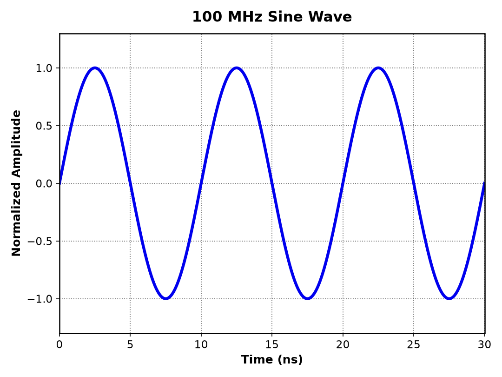
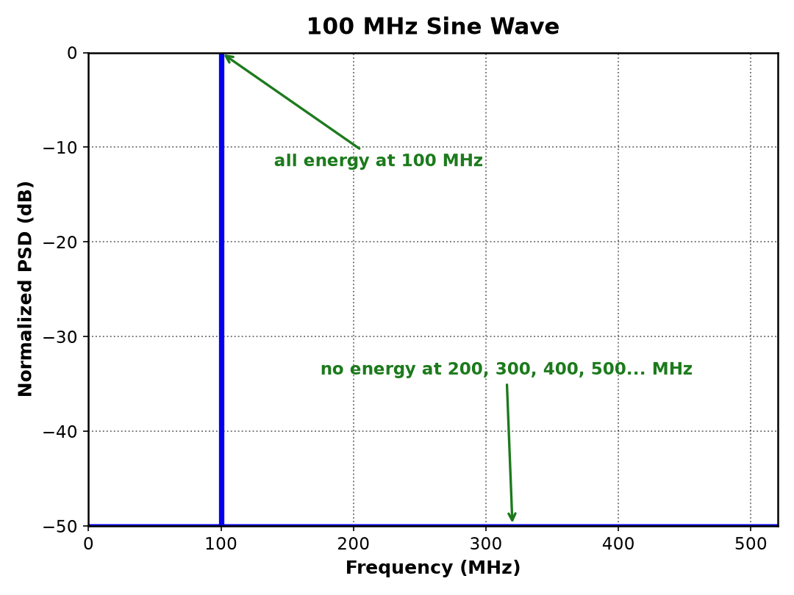
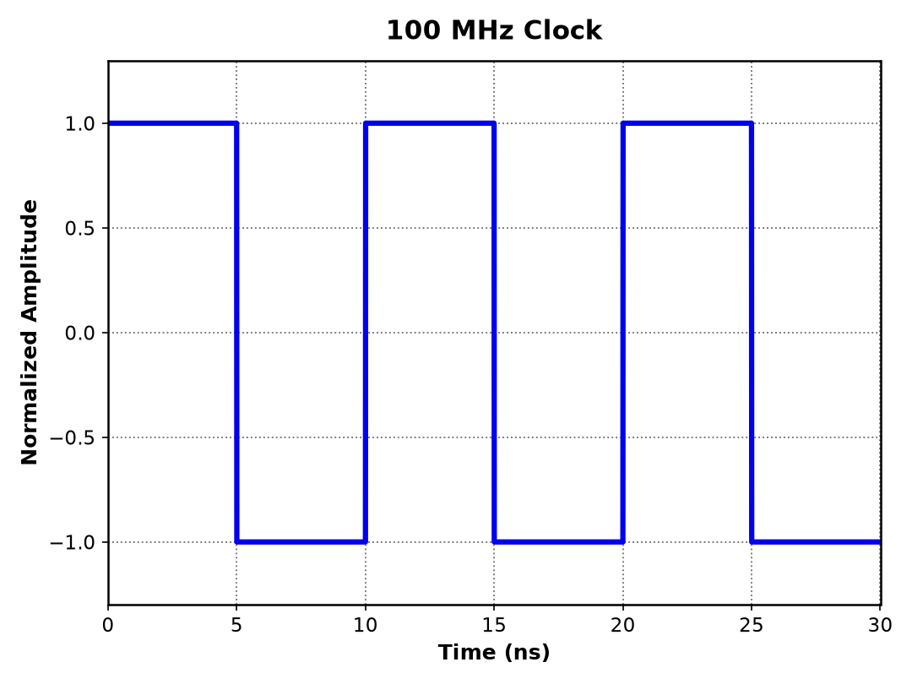
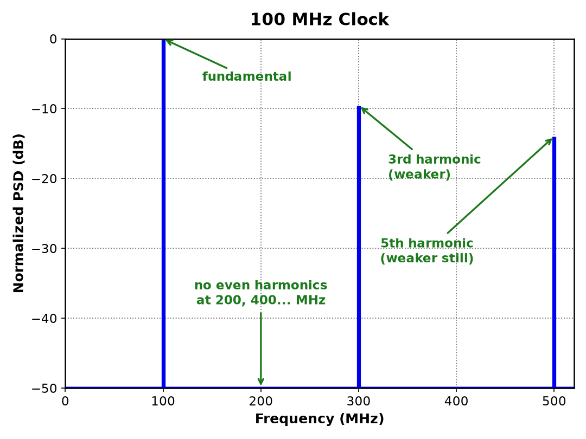
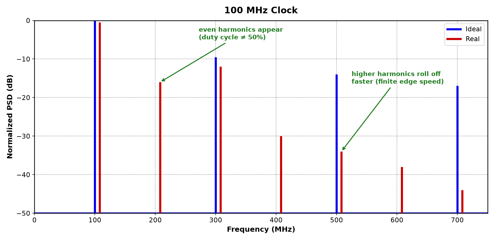
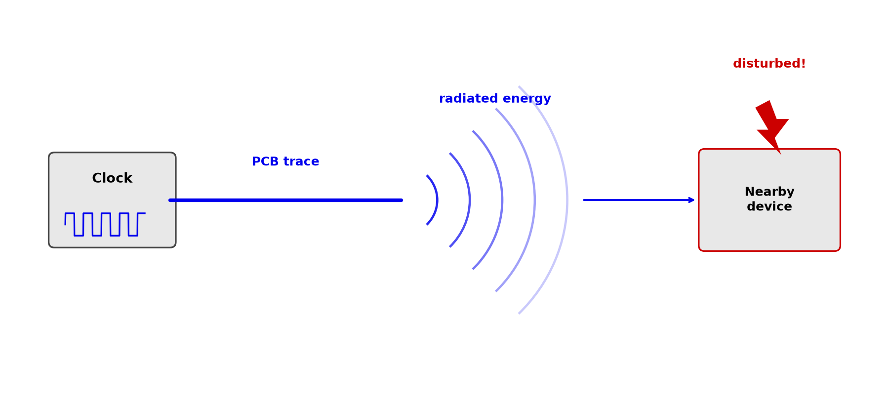
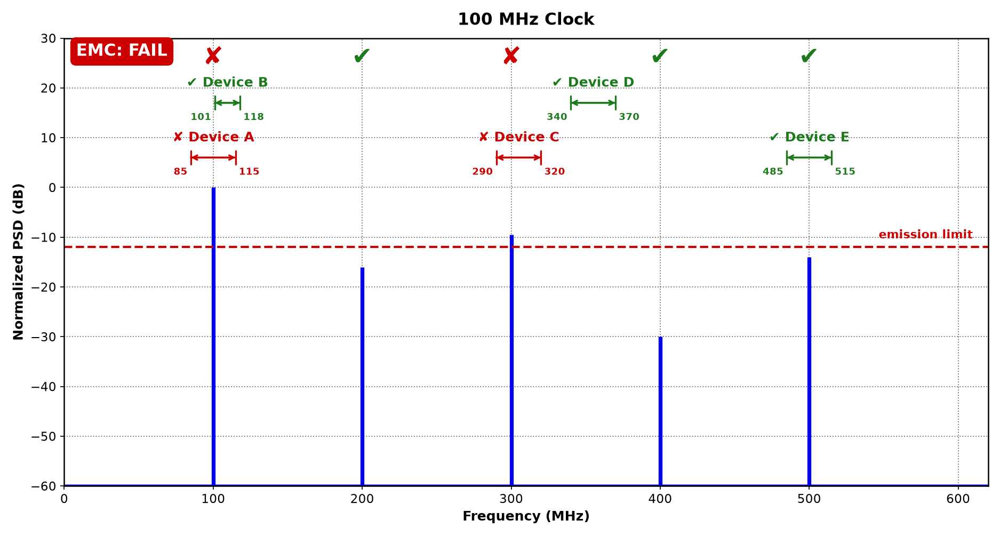
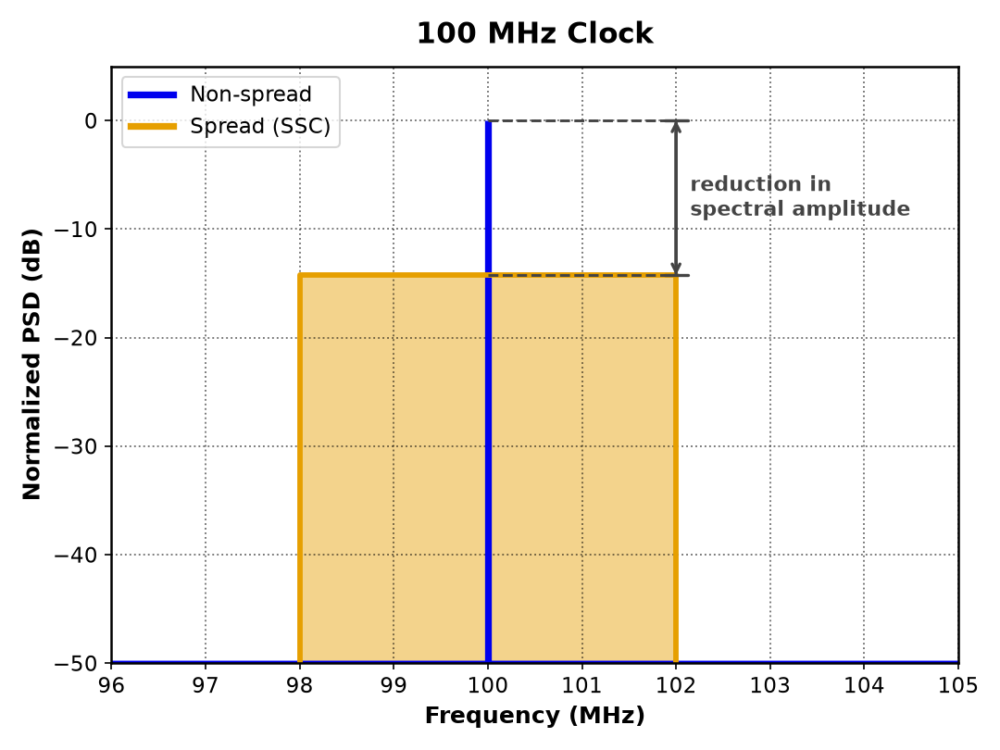
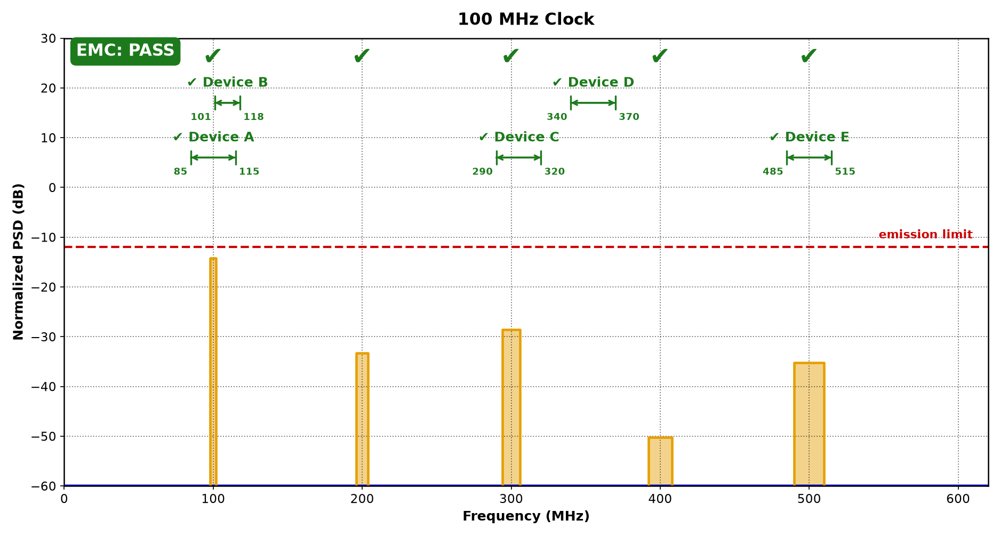
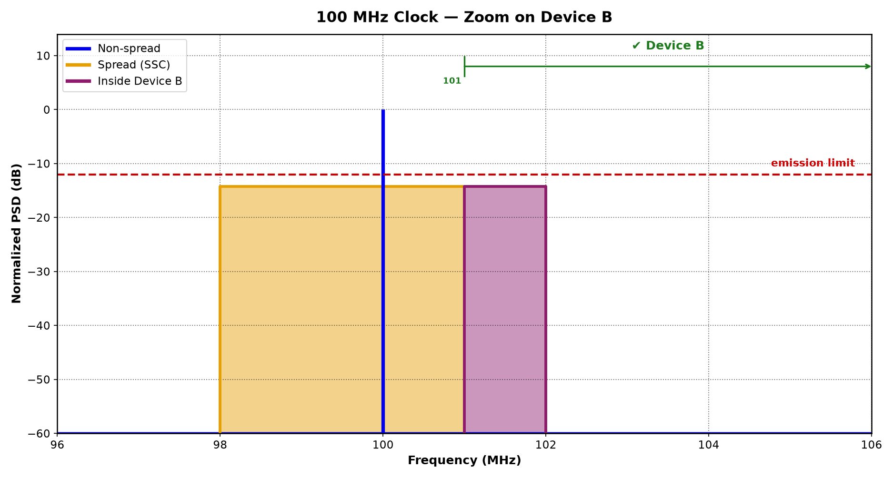

---
title: About Us - Amarula Solutions
---

::title::

About Us - Amarula Solutions

::body::

  

    <ul class="flex flex-col gap-4 text-2xl">
      <li class="font-semibold">
        Software Consulting Across Europe
        <ul class="text-lg font-normal">
          <li>Offices in multiple European countries</li>
          <li>Focused on mobile apps, cloud platforms, and embedded systems</li>
        </ul>
      </li>
      <li class="font-semibold">
        Full-Stack Embedded Expertise
        <ul class="text-lg font-normal">
          <li>From bootloaders & kernels to UI applications</li>
          <li>Deep knowledge of Android & Linux OS</li>
        </ul>
      </li>
      <li class="font-semibold">
        Open Source at our Core
        <ul class="text-lg font-normal">
          <li>Active upstream contributions</li>
          <li>Solutions built for security and long-term maintainability</li>
        </ul>
      </li>
    </ul>
  

  

    
    

      <a href="mailto:info@amarulasolutions.com" class="inline-flex items-center gap-2 text-lg text-blue-500 underline !border-b-0">
        <mdi-email />
        info@amarulasolutions.com
      </a>
      <a href="www.amarulasolutions.com" class="inline-flex items-center gap-2 text-lg text-blue-500 underline !border-b-0">
        <mdi-web />
        www.amarulasolutions.com
      </a>
    

  

---
title: About Us - Dario Binacchi
---

::title::

About Us - Dario Binacchi

::body::

  

    <ul class="flex flex-col gap-4 text-3xl font-medium">
      <li class="flex items-center gap-4">
        
        Buildroot
      </li>
      <li class="flex items-center gap-4">
        
        Yocto
      </li>
      <li class="flex items-center gap-4">
        <logos-linux-tux class="w-10 h-10" />
        Linux
      </li>
      <li class="flex items-center gap-4">
        
        U-Boot
      </li>
      <li class="flex items-center gap-4">
        
        Zephyr
      </li>
    </ul>
  

  

    
    

      <a href="mailto:dario.binacchi@amarulasolutions.com" class="inline-flex items-center gap-2 text-lg text-blue-500 underline !border-b-0">
        <mdi-email />
        dario.binacchi@amarulasolutions.com
      </a>
      <a href="https://passgat.github.io/" class="inline-flex items-center gap-2 text-lg text-blue-500 underline !border-b-0">
        <mdi-github />
        https://passgat.github.io/
      </a>
    

  

---
title: Agenda
---

::title::

Agenda

::body::

<Agenda />

---
title: Understanding SSC - Sine Wave
---

::title::

Understanding SSC - Sine Wave

::body::

  

    The only waveform at a <strong>single</strong>, <strong>exact</strong> <strong>frequency</strong>
  

  

    
    
  

---
title: Understanding SSC - Digital Clock
---

::title::

Understanding SSC - Digital Clock

::body::

  

    A sum of sine waves: the <strong>fundamental</strong> plus its <strong>harmonics</strong>
  

  

    
    
  

---
title: Understanding SSC - Real Digital Clock
---

::title::

Understanding SSC - Real Digital Clock

::body::

  

    finite edges, duty cycle &ne; 50%
  

  

---
title: Understanding SSC - EMI
---

::title::

Understanding SSC - EMI

::body::

  <ul class="list-disc pl-5 text-2xl space-y-4 max-w-4xl">
    <li>A digital clock: energy spikes at the fundamental and its harmonics</li>
    <li>PCB traces: unintentional antennas radiating that energy</li>
    <li>Nearby devices: can be disturbed</li>
  </ul>
  

---
title: Understanding SSC - How Do We Fix It ?
---

::title::

Understanding SSC - How Do We Fix It ?

::body::

  

    <strong>Drop</strong> the peak below the limit <strong>enabling</strong> <strong>SSC</strong>
  

  

---
title: Understanding SSC - What Is It ?
---

::title::

Understanding SSC - What Is It ?

::body::

  

    A technique to spread the spectral energy over a band of frequencies
  

  

---
title: Understanding SSC - Fixed
---

::title::

Understanding SSC - Fixed

::body::

  

---
title: Understanding SSC - A New Issue ?
---

::title::

Understanding SSC - A New Issue ?

::body::

  

    Energy can now reach previously unaffected frequency bands
  

  

---
title: Understanding SSC - How Does It Work ?
---

::title::

Understanding SSC - How Does It Work ?

::body::

  <ul class="list-disc pl-5 mt-[23px] text-2xl space-y-3 max-w-4xl">
    <li>The clock frequency is <strong>frequency-modulated</strong> around its nominal value</li>
    <li><strong>Four</strong> parameters configure the spread:
      <ul class="list-none pl-0 mt-2 space-y-1">
        <li class="flex items-start gap-3">
          <mdi-arrow-up-down-bold class="w-10 h-10 shrink-0 text-[#fdcb0e]" />
          Spreading <strong>depth</strong>
        </li>
        <li class="flex items-start gap-3">
          <mdi-minus-thick class="w-10 h-10 shrink-0 text-[#fdcb0e]" />
          Modulation <strong>rate</strong>
        </li>
        <li class="flex items-start gap-3">
          <mdi-arrow-up-down-bold class="w-10 h-10 shrink-0 text-[#fdcb0e]" />
          Modulation <strong>profile</strong>: Triangular, Sinusoidal or Hershey-kiss
        </li>
        <li class="flex items-start gap-3">
          <mdi-swap-horizontal-bold class="w-10 h-10 shrink-0 text-[#fdcb0e]" />
          <strong>Spread type</strong>: Down, Center or Up
        </li>
      </ul>
    </li>
    <li>The total energy remains <strong>unchanged</strong></li>
  </ul>
  

    <mdi-alert class="w-11 h-11 text-[#fdcb0e] shrink-0" />
    <b>Increases clock jitter</b> &mdash; not suitable for timing-sensitive peripherals
  

---
title: Understanding SSC - In Action
---

::title::

Understanding SSC - In Action

::body::

  
  

    <mdi-scale-balance class="w-11 h-11 text-[#fdcb0e] shrink-0" />
    <b>Total energy unchanged</b> &mdash; half the band, twice the density
    lowhigh
  

---
title: Linux SSC Case Studies
---

::title::

Linux SSC Case Studies

::body::

<Agenda :current="1" />

---
title: AM33xx/AM43xx - Hardware
---

::title::

AM33xx/AM43xx - Hardware

::body::

  

    SSC is supported for the <b>DISP</b> and <b>MPU</b> PLLs
  

  

  

    <mdi-hand-pointing-right class="w-11 h-11 text-[#fdcb0e] shrink-0" />
    Enabling SSC restricts the valid range of the PLL multiplier (M)
  

---
title: AM33xx/AM43xx - Linux Integration
---

::title::

AM33xx/AM43xx - Linux Integration

::body::

  

    

    
    Upstream status
    Add am33xx/am43xx spread spectrum clock support
  

    

      <b>Mar 2021</b>
      &rarr;
      <b>v7 Jun 2021</b>
      &rarr;
      <b>Merged</b>
      &rarr;
      <b>Linux 5.14</b>
      &middot;
      author <b>Dario Binacchi</b>
    

  

  

    

      Documentation/devicetree/bindings/clock/ti/dpll.txt
    

    

      
ti,ssc-deltam

      
spreading depth, in tenths of a percent

      
ti,ssc-modfreq-hz

      
modulation rate

      
ti,ssc-downspread

      
spread type, boolean &mdash; down-spread instead of center

      
ti,min-div

      
floor for N, so the rounded M stays in range &mdash; <b>not about EMI at all</b>

    

  

  

  

    drivers/clk/ti/dpll3xxx.c
  

    

      
1 &mdash; on rate change

      
int&nbsp;<b>omap3_noncore_dpll_set_rate</b>(struct&nbsp;clk_hw&nbsp;*hw,&nbsp;unsigned&nbsp;long&nbsp;rate,

      

      
&nbsp;&nbsp;&nbsp;&nbsp;&nbsp;&nbsp;&nbsp;&nbsp;&nbsp;&nbsp;&nbsp;&nbsp;&nbsp;&nbsp;&nbsp;&nbsp;&nbsp;&nbsp;&nbsp;&nbsp;&nbsp;&nbsp;&nbsp;&nbsp;&nbsp;&nbsp;&nbsp;&nbsp;&nbsp;&nbsp;&nbsp;&nbsp;unsigned&nbsp;long&nbsp;parent_rate)

      

      
{

      

      
&nbsp;&nbsp;&nbsp;&nbsp;&nbsp;&nbsp;&nbsp;&nbsp;ret&nbsp;=&nbsp;<b>omap3_noncore_dpll_program</b>(clk,&nbsp;freqsel);

      

      

      
2 &mdash; after M, N calculation

      
static&nbsp;int&nbsp;<b>omap3_noncore_dpll_program</b>(struct&nbsp;clk_hw_omap&nbsp;*clk,&nbsp;u16&nbsp;freqsel)

      

      
{

      

      
&nbsp;&nbsp;&nbsp;&nbsp;&nbsp;&nbsp;&nbsp;&nbsp;if&nbsp;(dd-&gt;ssc_enable_mask)

      

      
&nbsp;&nbsp;&nbsp;&nbsp;&nbsp;&nbsp;&nbsp;&nbsp;&nbsp;&nbsp;&nbsp;&nbsp;&nbsp;&nbsp;&nbsp;&nbsp;<b style="color:#22863a">omap3_noncore_dpll_ssc_program</b>(clk);

      

      

      
3 &mdash; SSC setup

      
static&nbsp;void&nbsp;<b style="color:#22863a">omap3_noncore_dpll_ssc_program</b>(struct&nbsp;clk_hw_omap&nbsp;*clk)

      

      
{

      

      
&nbsp;&nbsp;&nbsp;&nbsp;&nbsp;&nbsp;&nbsp;&nbsp;ctrl&nbsp;|=&nbsp;dd-&gt;ssc_enable_mask;

      

      
&nbsp;&nbsp;&nbsp;&nbsp;&nbsp;&nbsp;&nbsp;&nbsp;if&nbsp;(dd-&gt;<b style="color:#22863a">ssc_downspread</b>)

      

      
&nbsp;&nbsp;&nbsp;&nbsp;&nbsp;&nbsp;&nbsp;&nbsp;&nbsp;&nbsp;&nbsp;&nbsp;&nbsp;&nbsp;&nbsp;&nbsp;ctrl&nbsp;|=&nbsp;dd-&gt;ssc_downspread_mask;

      

      
&nbsp;&nbsp;&nbsp;&nbsp;&nbsp;&nbsp;&nbsp;&nbsp;mod_freq_divider&nbsp;=

      

      
&nbsp;&nbsp;&nbsp;&nbsp;&nbsp;&nbsp;&nbsp;&nbsp;&nbsp;&nbsp;&nbsp;&nbsp;(ref_rate&nbsp;/&nbsp;dd-&gt;<b style="color:#22863a">last_rounded_n</b>)&nbsp;/&nbsp;(4&nbsp;*&nbsp;dd-&gt;<b style="color:#22863a">ssc_modfreq</b>);

      

      
&nbsp;&nbsp;&nbsp;&nbsp;&nbsp;&nbsp;&nbsp;&nbsp;deltam_step&nbsp;=&nbsp;dd-&gt;<b style="color:#22863a">last_rounded_m</b>&nbsp;*&nbsp;dd-&gt;<b style="color:#22863a">ssc_deltam</b>;

      

      
&nbsp;&nbsp;&nbsp;&nbsp;&nbsp;&nbsp;&nbsp;&nbsp;ti_clk_ll_ops-&gt;clk_writel(v,&nbsp;&amp;dd-&gt;ssc_deltam_reg);

      

      
&nbsp;&nbsp;&nbsp;&nbsp;&nbsp;&nbsp;&nbsp;&nbsp;ti_clk_ll_ops-&gt;clk_writel(ctrl,&nbsp;&amp;dd-&gt;control_reg);

    

  

---
title: AM33xx/AM43xx - SSC In Action
---

::title::

AM33xx/AM43xx - SSC In Action

::body::

  

    Custom board: two panels, two overlays
  

LCD panel 800x480 @ 33 MHz &middot; SSC: &plusmn;11.4 %, 6 kHz

    

      
fragment@2&nbsp;{

      
&nbsp;&nbsp;&nbsp;&nbsp;&nbsp;&nbsp;&nbsp;&nbsp;target&nbsp;=&nbsp;&lt;&amp;display_timings_timing&gt;;

      
&nbsp;&nbsp;&nbsp;&nbsp;&nbsp;&nbsp;&nbsp;&nbsp;__overlay__&nbsp;{

      
&nbsp;&nbsp;&nbsp;&nbsp;&nbsp;&nbsp;&nbsp;&nbsp;&nbsp;&nbsp;&nbsp;&nbsp;hactive&nbsp;&nbsp;&nbsp;&nbsp;&nbsp;&nbsp;&nbsp;&nbsp;&nbsp;=&nbsp;&lt;800&gt;;

      
&nbsp;&nbsp;&nbsp;&nbsp;&nbsp;&nbsp;&nbsp;&nbsp;&nbsp;&nbsp;&nbsp;&nbsp;vactive&nbsp;&nbsp;&nbsp;&nbsp;&nbsp;&nbsp;&nbsp;&nbsp;&nbsp;=&nbsp;&lt;480&gt;;

      
&nbsp;&nbsp;&nbsp;&nbsp;&nbsp;&nbsp;&nbsp;&nbsp;&nbsp;&nbsp;&nbsp;&nbsp;hback-porch&nbsp;&nbsp;&nbsp;&nbsp;&nbsp;=&nbsp;&lt;46&gt;;

      
&nbsp;&nbsp;&nbsp;&nbsp;&nbsp;&nbsp;&nbsp;&nbsp;&nbsp;&nbsp;&nbsp;&nbsp;hfront-porch&nbsp;&nbsp;&nbsp;&nbsp;=&nbsp;&lt;210&gt;;

      
&nbsp;&nbsp;&nbsp;&nbsp;&nbsp;&nbsp;&nbsp;&nbsp;&nbsp;&nbsp;&nbsp;&nbsp;hsync-len&nbsp;&nbsp;&nbsp;&nbsp;&nbsp;&nbsp;&nbsp;=&nbsp;&lt;20&gt;;

      
&nbsp;&nbsp;&nbsp;&nbsp;&nbsp;&nbsp;&nbsp;&nbsp;&nbsp;&nbsp;&nbsp;&nbsp;vback-porch&nbsp;&nbsp;&nbsp;&nbsp;&nbsp;=&nbsp;&lt;23&gt;;

      
&nbsp;&nbsp;&nbsp;&nbsp;&nbsp;&nbsp;&nbsp;&nbsp;&nbsp;&nbsp;&nbsp;&nbsp;vfront-porch&nbsp;&nbsp;&nbsp;&nbsp;=&nbsp;&lt;22&gt;;

      
&nbsp;&nbsp;&nbsp;&nbsp;&nbsp;&nbsp;&nbsp;&nbsp;&nbsp;&nbsp;&nbsp;&nbsp;vsync-len&nbsp;&nbsp;&nbsp;&nbsp;&nbsp;&nbsp;&nbsp;=&nbsp;&lt;10&gt;;

      
<b>&nbsp;&nbsp;&nbsp;&nbsp;&nbsp;&nbsp;&nbsp;&nbsp;&nbsp;&nbsp;&nbsp;&nbsp;clock-frequency&nbsp;=&nbsp;&lt;33000000&gt;;</b>

      
&nbsp;&nbsp;&nbsp;&nbsp;&nbsp;&nbsp;&nbsp;&nbsp;&nbsp;&nbsp;&nbsp;&nbsp;hsync-active&nbsp;&nbsp;&nbsp;&nbsp;=&nbsp;&lt;0&gt;;

      
&nbsp;&nbsp;&nbsp;&nbsp;&nbsp;&nbsp;&nbsp;&nbsp;&nbsp;&nbsp;&nbsp;&nbsp;vsync-active&nbsp;&nbsp;&nbsp;&nbsp;=&nbsp;&lt;0&gt;;

      
&nbsp;&nbsp;&nbsp;&nbsp;&nbsp;&nbsp;&nbsp;&nbsp;};

      
};

      

      
fragment@6&nbsp;{

      
&nbsp;&nbsp;&nbsp;&nbsp;&nbsp;&nbsp;&nbsp;&nbsp;target&nbsp;=&nbsp;&lt;&amp;dpll_disp_ck&gt;;

      
&nbsp;&nbsp;&nbsp;&nbsp;&nbsp;&nbsp;&nbsp;&nbsp;__overlay__&nbsp;{

      
<b>&nbsp;&nbsp;&nbsp;&nbsp;&nbsp;&nbsp;&nbsp;&nbsp;&nbsp;&nbsp;&nbsp;&nbsp;ti,min-div&nbsp;=&nbsp;&lt;40&gt;;</b>

      
<b>&nbsp;&nbsp;&nbsp;&nbsp;&nbsp;&nbsp;&nbsp;&nbsp;&nbsp;&nbsp;&nbsp;&nbsp;ti,ssc-modfreq-hz&nbsp;=&nbsp;&lt;6000&gt;;</b>

      
<b>&nbsp;&nbsp;&nbsp;&nbsp;&nbsp;&nbsp;&nbsp;&nbsp;&nbsp;&nbsp;&nbsp;&nbsp;ti,ssc-deltam&nbsp;=&nbsp;&lt;114&gt;;</b>

      
&nbsp;&nbsp;&nbsp;&nbsp;&nbsp;&nbsp;&nbsp;&nbsp;};

      
};

    

LCD panel 800x600 @ 40 MHz &middot; SSC: &plusmn;2.9 %, 10 kHz

    

      
fragment@2&nbsp;{

      
&nbsp;&nbsp;&nbsp;&nbsp;&nbsp;&nbsp;&nbsp;&nbsp;target&nbsp;=&nbsp;&lt;&amp;display_timings_timing&gt;;

      
&nbsp;&nbsp;&nbsp;&nbsp;&nbsp;&nbsp;&nbsp;&nbsp;__overlay__&nbsp;{

      
&nbsp;&nbsp;&nbsp;&nbsp;&nbsp;&nbsp;&nbsp;&nbsp;&nbsp;&nbsp;&nbsp;&nbsp;hactive&nbsp;&nbsp;&nbsp;&nbsp;&nbsp;&nbsp;&nbsp;&nbsp;&nbsp;=&nbsp;&lt;800&gt;;

      
&nbsp;&nbsp;&nbsp;&nbsp;&nbsp;&nbsp;&nbsp;&nbsp;&nbsp;&nbsp;&nbsp;&nbsp;vactive&nbsp;&nbsp;&nbsp;&nbsp;&nbsp;&nbsp;&nbsp;&nbsp;&nbsp;=&nbsp;&lt;600&gt;;

      
&nbsp;&nbsp;&nbsp;&nbsp;&nbsp;&nbsp;&nbsp;&nbsp;&nbsp;&nbsp;&nbsp;&nbsp;hback-porch&nbsp;&nbsp;&nbsp;&nbsp;&nbsp;=&nbsp;&lt;46&gt;;

      
&nbsp;&nbsp;&nbsp;&nbsp;&nbsp;&nbsp;&nbsp;&nbsp;&nbsp;&nbsp;&nbsp;&nbsp;hfront-porch&nbsp;&nbsp;&nbsp;&nbsp;=&nbsp;&lt;210&gt;;

      
&nbsp;&nbsp;&nbsp;&nbsp;&nbsp;&nbsp;&nbsp;&nbsp;&nbsp;&nbsp;&nbsp;&nbsp;hsync-len&nbsp;&nbsp;&nbsp;&nbsp;&nbsp;&nbsp;&nbsp;=&nbsp;&lt;20&gt;;

      
&nbsp;&nbsp;&nbsp;&nbsp;&nbsp;&nbsp;&nbsp;&nbsp;&nbsp;&nbsp;&nbsp;&nbsp;vback-porch&nbsp;&nbsp;&nbsp;&nbsp;&nbsp;=&nbsp;&lt;15&gt;;

      
&nbsp;&nbsp;&nbsp;&nbsp;&nbsp;&nbsp;&nbsp;&nbsp;&nbsp;&nbsp;&nbsp;&nbsp;vfront-porch&nbsp;&nbsp;&nbsp;&nbsp;=&nbsp;&lt;13&gt;;

      
&nbsp;&nbsp;&nbsp;&nbsp;&nbsp;&nbsp;&nbsp;&nbsp;&nbsp;&nbsp;&nbsp;&nbsp;vsync-len&nbsp;&nbsp;&nbsp;&nbsp;&nbsp;&nbsp;&nbsp;=&nbsp;&lt;10&gt;;

      
<b>&nbsp;&nbsp;&nbsp;&nbsp;&nbsp;&nbsp;&nbsp;&nbsp;&nbsp;&nbsp;&nbsp;&nbsp;clock-frequency&nbsp;=&nbsp;&lt;40000000&gt;;</b>

      
&nbsp;&nbsp;&nbsp;&nbsp;&nbsp;&nbsp;&nbsp;&nbsp;&nbsp;&nbsp;&nbsp;&nbsp;hsync-active&nbsp;&nbsp;&nbsp;&nbsp;=&nbsp;&lt;0&gt;;

      
&nbsp;&nbsp;&nbsp;&nbsp;&nbsp;&nbsp;&nbsp;&nbsp;&nbsp;&nbsp;&nbsp;&nbsp;vsync-active&nbsp;&nbsp;&nbsp;&nbsp;=&nbsp;&lt;0&gt;;

      
&nbsp;&nbsp;&nbsp;&nbsp;&nbsp;&nbsp;&nbsp;&nbsp;};

      
};

      

      
fragment@6&nbsp;{

      
&nbsp;&nbsp;&nbsp;&nbsp;&nbsp;&nbsp;&nbsp;&nbsp;target&nbsp;=&nbsp;&lt;&amp;dpll_disp_ck&gt;;

      
&nbsp;&nbsp;&nbsp;&nbsp;&nbsp;&nbsp;&nbsp;&nbsp;__overlay__&nbsp;{

      
<b>&nbsp;&nbsp;&nbsp;&nbsp;&nbsp;&nbsp;&nbsp;&nbsp;&nbsp;&nbsp;&nbsp;&nbsp;ti,min-div&nbsp;=&nbsp;&lt;12&gt;;</b>

      
<b>&nbsp;&nbsp;&nbsp;&nbsp;&nbsp;&nbsp;&nbsp;&nbsp;&nbsp;&nbsp;&nbsp;&nbsp;ti,ssc-modfreq-hz&nbsp;=&nbsp;&lt;10000&gt;;</b>

      
<b>&nbsp;&nbsp;&nbsp;&nbsp;&nbsp;&nbsp;&nbsp;&nbsp;&nbsp;&nbsp;&nbsp;&nbsp;ti,ssc-deltam&nbsp;=&nbsp;&lt;29&gt;;</b>

      
&nbsp;&nbsp;&nbsp;&nbsp;&nbsp;&nbsp;&nbsp;&nbsp;};

      
};

    

---
title: AM33xx/AM43xx - Design Notes
---

::title::

AM33xx/AM43xx - Design Notes

::body::

  

    &#128204;
    <ul class="list-disc pl-6 text-2xl space-y-6 [&>li]:!my-0 [&>li]:!leading-snug">
      <li>
        <b>Clock-specific DT nodes</b> allow easy and precise SSC configuration
      </li>
      <li>
        <b>No profile DT property</b>
      </li>
      <li>
        <b>SoC-specific DT property</b> required
        (ti,min-div)
      </li>
    </ul>
  

---
title: STM32F4/STM32F7 - Hardware
---

::title::

STM32F4/STM32F7 - Hardware

::body::

  

    SSC is only supported for the <b>main</b> PLL
  

  

---
title: STM32F4/STM32F7 - Linux Integration
---

::title::

STM32F4/STM32F7 - Linux Integration

::body::

  

    

      
      Upstream status
      Support spread spectrum clocking for stm32f{4,7} platforms
    

    

      <b>5 Jan 2025</b>
      &rarr;
      <b>v4 14 Jan 2025</b>
      &rarr;
      <b>Merged</b>
      &rarr;
      <b>Linux 6.14</b>
      &middot;
      author <b>Dario Binacchi</b>
    

  

  

    

      Documentation/devicetree/bindings/clock/st,stm32-rcc.yaml
    

    

      
st,ssc-moddepth-permyriad

      
spreading depth, in hundredths of a percent

      
st,ssc-modfreq-hz

      
modulation rate

      
st,ssc-modmethod

      
spread type, string &mdash; "center-spread" or "down-spread"

    

  

  

  

    drivers/clk/clk-stm32f4.c
  

    

      
1 &mdash; on init

      
static&nbsp;void&nbsp;__init&nbsp;<b>stm32f4_rcc_init</b>(struct&nbsp;device_node&nbsp;*np)

      

      
{

      

      
&nbsp;&nbsp;&nbsp;&nbsp;&nbsp;&nbsp;&nbsp;&nbsp;if&nbsp;(!<b style="color:#22863a">stm32f4_pll_ssc_parse_dt</b>(np,&nbsp;&amp;ssc_conf))

      

      
&nbsp;&nbsp;&nbsp;&nbsp;&nbsp;&nbsp;&nbsp;&nbsp;&nbsp;&nbsp;&nbsp;&nbsp;&nbsp;&nbsp;&nbsp;&nbsp;<b style="color:#22863a">stm32f4_pll_init_ssc</b>(pll_vco_hw,&nbsp;&amp;ssc_conf);

      

      

      
2 &mdash; on rate change

      
static&nbsp;int&nbsp;<b>stm32f4_pll_set_rate</b>(struct&nbsp;clk_hw&nbsp;*hw,&nbsp;unsigned&nbsp;long&nbsp;rate,

      

      
&nbsp;&nbsp;&nbsp;&nbsp;&nbsp;&nbsp;&nbsp;&nbsp;&nbsp;&nbsp;&nbsp;&nbsp;&nbsp;&nbsp;&nbsp;&nbsp;&nbsp;&nbsp;&nbsp;&nbsp;&nbsp;&nbsp;&nbsp;&nbsp;&nbsp;&nbsp;&nbsp;&nbsp;&nbsp;&nbsp;&nbsp;&nbsp;unsigned&nbsp;long&nbsp;parent_rate)

      

      
{

      

      
&nbsp;&nbsp;&nbsp;&nbsp;&nbsp;&nbsp;&nbsp;&nbsp;if&nbsp;(pll-&gt;ssc_enable)

      

      
&nbsp;&nbsp;&nbsp;&nbsp;&nbsp;&nbsp;&nbsp;&nbsp;&nbsp;&nbsp;&nbsp;&nbsp;&nbsp;&nbsp;&nbsp;&nbsp;<b style="color:#22863a">stm32f4_pll_set_ssc</b>(hw,&nbsp;parent_rate,&nbsp;<b style="color:#22863a">n</b>);

      

      

      
3 &mdash; SSC setup

      
static&nbsp;void&nbsp;<b style="color:#22863a">stm32f4_pll_set_ssc</b>(struct&nbsp;clk_hw&nbsp;*hw,&nbsp;unsigned&nbsp;long&nbsp;parent_rate,

      

      
&nbsp;&nbsp;&nbsp;&nbsp;&nbsp;&nbsp;&nbsp;&nbsp;&nbsp;&nbsp;&nbsp;&nbsp;&nbsp;&nbsp;&nbsp;&nbsp;&nbsp;&nbsp;&nbsp;&nbsp;&nbsp;&nbsp;&nbsp;&nbsp;&nbsp;&nbsp;&nbsp;&nbsp;&nbsp;&nbsp;&nbsp;&nbsp;unsigned&nbsp;int&nbsp;<b style="color:#22863a">ndiv</b>)

      

      
{

      

      
&nbsp;&nbsp;&nbsp;&nbsp;&nbsp;&nbsp;&nbsp;&nbsp;modeper&nbsp;=&nbsp;DIV_ROUND_CLOSEST(parent_rate,&nbsp;4&nbsp;*&nbsp;ssc-&gt;<b style="color:#22863a">mod_freq</b>);

      

      
&nbsp;&nbsp;&nbsp;&nbsp;&nbsp;&nbsp;&nbsp;&nbsp;incstep&nbsp;=&nbsp;DIV_ROUND_CLOSEST(((1&nbsp;&lt;&lt;&nbsp;15)&nbsp;-&nbsp;1)&nbsp;*&nbsp;ssc-&gt;<b style="color:#22863a">mod_depth</b>&nbsp;*&nbsp;<b style="color:#22863a">ndiv</b>,

      

      
&nbsp;&nbsp;&nbsp;&nbsp;&nbsp;&nbsp;&nbsp;&nbsp;&nbsp;&nbsp;&nbsp;&nbsp;&nbsp;&nbsp;&nbsp;&nbsp;&nbsp;&nbsp;&nbsp;&nbsp;&nbsp;&nbsp;&nbsp;&nbsp;&nbsp;&nbsp;&nbsp;&nbsp;&nbsp;&nbsp;&nbsp;&nbsp;&nbsp;&nbsp;&nbsp;&nbsp;5&nbsp;*&nbsp;10000&nbsp;*&nbsp;modeper);

      

      
&nbsp;&nbsp;&nbsp;&nbsp;&nbsp;&nbsp;&nbsp;&nbsp;if&nbsp;(ssc-&gt;<b style="color:#22863a">mod_type</b>)

      

      
&nbsp;&nbsp;&nbsp;&nbsp;&nbsp;&nbsp;&nbsp;&nbsp;&nbsp;&nbsp;&nbsp;&nbsp;&nbsp;&nbsp;&nbsp;&nbsp;sscgr&nbsp;|=&nbsp;STM32F4_RCC_SSCGR_SPREADSEL;

      

      
&nbsp;&nbsp;&nbsp;&nbsp;&nbsp;&nbsp;&nbsp;&nbsp;writel(sscgr,&nbsp;base&nbsp;+&nbsp;STM32F4_RCC_SSCGR);

    

  

---
title: STM32F4/STM32F7 - SSC In Action
---

::title::

STM32F4/STM32F7 - SSC In Action

::body::

  

    Reset clock controller setup
  

  

SSC: 2 %, 10 kHz, center-spread

    

      
&amp;rcc {

      
<b>&nbsp;&nbsp;&nbsp;&nbsp;&nbsp;&nbsp;&nbsp;&nbsp;st,ssc-moddepth-permyriad&nbsp;=&nbsp;&lt;200&gt;;</b>

      
<b>&nbsp;&nbsp;&nbsp;&nbsp;&nbsp;&nbsp;&nbsp;&nbsp;st,ssc-modfreq-hz&nbsp;=&nbsp;&lt;10000&gt;;</b>

      
<b>&nbsp;&nbsp;&nbsp;&nbsp;&nbsp;&nbsp;&nbsp;&nbsp;st,ssc-modmethod&nbsp;=&nbsp;"center-spread";</b>

      
};

    

  

---
title: STM32F4/STM32F7 - Design Notes
---

::title::

STM32F4/STM32F7 - Design Notes

::body::

  

    &#128204;
    <ul class="list-disc pl-6 text-2xl space-y-2 [&>li]:!my-0 [&>li]:!leading-snug">
      <li>
        SSC properties are <b>defined in the RCC node</b>
        <ul class="list-[circle] pl-6 mt-1 text-lg [&>li]:!my-0">
          <li>Main PLL is <b>implicitly referenced</b></li>
        </ul>
      </li>
      <li class="pt-7">
        <b>No profile DT property</b>
      </li>
      <li class="pt-7">
        <b>Different DT representations</b> across SoCs
        

          
Parameter

          
AM33xx/AM43xx

          
STM32F4/STM32F7

          

          
Spreading depth

          
ti,ssc-deltam

          
st,ssc-moddepth-permyriad

          
&#9888;&#65039; Different name/unit

          
Modulation rate

          
ti,ssc-modfreq-hz

          
st,ssc-modfreq-hz

          
&#9989; Same name

          
Spread type

          
ti,ssc-downspread

          
st,ssc-modmethod

          
&#9888;&#65039; Different representation

        

      </li>
    </ul>
  

---
title: i.MX8M Mini/Nano/Plus - Hardware
---

::title::

i.MX8M Mini/Nano/Plus - Hardware

::body::

  

    SSC is supported for <b>audio</b>, <b>video</b> and <b>DRAM</b> PLLs
  

  

---
title: i.MX8M Mini/Nano/Plus - Linux Integration
---

::title::

i.MX8M Mini/Nano/Plus - Linux Integration

::body::

  

    

      
      Upstream status
      Support spread spectrum clocking for i.MX8{M,N,P} PLLs
    

    

      

        <b>Sep 2024</b>
        &rarr;
        <b>v9 Jan 2025</b>
        &rarr;
        <b>Superseded</b>
        &middot;
      

      
author <b>Dario Binacchi</b>

      

      
reviewers <b>Krzysztof Kozlowski</b> 3 Reviewed-by, 2 Acked-by

      

      
reviewers <b>Peng Fan</b> 6 Reviewed-by

    

  

  

    

      DT Design
    

    
1 &mdash; i.MX8M

    

      <ul class="list-disc pl-8 space-y-1 [&>li]:!my-0 [&>li]:!leading-snug">
        <li>DT clock controller node (CCM)</li>
        <li>four SSC PLLs</li>
      </ul>
    

    

    
2 &mdash; Existing designs

    

      
AM33xx/AM43xx

      
&#10007;

      
PLL is a DT node

      
STM32F4/STM32F7

      
&#10003;

      
DT clock controller node (RCC)

      

      
&#10007;

      
one PLL, implicitly referenced

    

    

    
3 &mdash; Proposed solution

    
Extend the STM32F4/STM32F7 design to explicitly reference the SSC PLLs

  

---
title: i.MX8M Mini/Nano/Plus - Linux Integration
---

::title::

i.MX8M Mini/Nano/Plus - Linux Integration

::body::

  

    

      v3
      Documentation/devicetree/bindings/clock/imx8m-clock.yaml
    

    

      
clock-controller@30380000 {

      
&nbsp;&nbsp;&nbsp;&nbsp;compatible = "fsl,imx8mm-ccm";

      
&nbsp;&nbsp;&nbsp;&nbsp;reg = &lt;0x30380000 0x10000&gt;;

      
&nbsp;&nbsp;&nbsp;&nbsp;#clock-cells = &lt;1&gt;;

      
<b>&nbsp;&nbsp;&nbsp;&nbsp;clocks = &lt;&amp;osc_32k&gt;, &lt;&amp;osc_24m&gt;, &lt;&amp;clk_ext1&gt;, &lt;&amp;clk_ext2&gt;,</b>

      
<b>&nbsp;&nbsp;&nbsp;&nbsp;&nbsp;&nbsp;&nbsp;&nbsp;&nbsp;&nbsp;&nbsp;&nbsp;&nbsp;&lt;&amp;clk_ext3&gt;, &lt;&amp;clk_ext4&gt;;</b>

      
<b>&nbsp;&nbsp;&nbsp;&nbsp;clock-names = "osc_32k", "osc_24m", "clk_ext1", "clk_ext2",</b>

      
<b>&nbsp;&nbsp;&nbsp;&nbsp;&nbsp;&nbsp;&nbsp;&nbsp;&nbsp;&nbsp;&nbsp;&nbsp;&nbsp;&nbsp;&nbsp;&nbsp;&nbsp;&nbsp;"clk_ext3", "clk_ext4";</b>

      

        
<b>&nbsp;&nbsp;&nbsp;&nbsp;fsl,ssc-clocks = &lt;&amp;clk IMX8MM_AUDIO_PLL1&gt;,</b>

        
<b>&nbsp;&nbsp;&nbsp;&nbsp;&nbsp;&nbsp;&nbsp;&nbsp;&nbsp;&nbsp;&nbsp;&nbsp;&nbsp;&nbsp;&nbsp;&nbsp;&nbsp;&nbsp;&nbsp;&nbsp;&nbsp;&lt;&amp;clk IMX8MM_VIDEO_PLL1&gt;;</b>

        
<b>&nbsp;&nbsp;&nbsp;&nbsp;fsl,ssc-modfreq-hz = &lt;6818&gt;, &lt;2419&gt;;</b>

        
<b>&nbsp;&nbsp;&nbsp;&nbsp;fsl,ssc-modrate-percent = &lt;3&gt;, &lt;7&gt;;</b>

        
<b>&nbsp;&nbsp;&nbsp;&nbsp;fsl,ssc-modmethod = "down-spread", "center-spread";</b>

        
&#10007;

      

    

  

  

    

      Maintainer&rsquo;s response
    

    
    

      &ldquo;How is it possible that you change spread spectrum of some clocks from
      main Clock Controller, while <b>this device is not a consumer of them</b>?&rdquo;
    

    
Krzysztof Kozlowski

  

---
title: i.MX8M Mini/Nano/Plus - Linux Integration
---

::title::

i.MX8M Mini/Nano/Plus - Linux Integration

::body::

  

    

      v4 DESIGN
    

    
1 &mdash; The hardware

    

      <svg viewBox="-26 8 980 140" class="w-full" role="img" aria-label="Block diagram. Two oscillators, osc_32k and osc_24m, each fork into two arrows: one enters the anatop block at address 0x30360000, the other runs underneath it and up into the CCM block at address 0x30380000. A third input, clk_ext1 to 4, runs straight into the CCM from below. Out of the anatop, four separate arrows cross to the CCM, labelled audio_pll1, audio_pll2, video_pll and dram_pll. Out of the CCM, one arrow leaves to peripheral clocks.">
        <defs>
          <marker id="ah" viewBox="0 0 10 10" refX="9" refY="5" markerWidth="7" markerHeight="7" orient="auto-start-reverse">
            <path d="M 0 0 L 10 5 L 0 10 z" fill="#9ca3af" />
          </marker>
        </defs>
        <g fill="none" stroke="#9ca3af" stroke-width="1.6" marker-end="url(#ah)">
          <path d="M 46 40 H 108" />
          <path d="M 46 62 H 108" />
          <path d="M 46 40 H 84 V 118 H 645 V 110" />
          <path d="M 46 62 H 92 V 128 H 670 V 110" />
          <path d="M 68 138 H 695 V 110" />
          <path d="M 230 32 H 618" />
          <path d="M 230 54 H 618" />
          <path d="M 230 76 H 618" />
          <path d="M 230 98 H 618" />
          <path d="M 740 62 H 778" />
        </g>
        <g fill="#ffffff" stroke="#6b7280" stroke-width="1.6">
          <rect x="110" y="16" width="120" height="92" rx="6" />
          <rect x="620" y="16" width="120" height="92" rx="6" />
        </g>
        <g fill="#111827" text-anchor="middle" style="font-weight:600">
          <text x="170" y="52" style="font-size:20px">anatop</text>
          <text x="680" y="52" style="font-size:20px">CCM</text>
        </g>
        <g font-family="ui-monospace, SFMono-Regular, Menlo, monospace" fill="#9ca3af" text-anchor="middle">
          <text x="170" y="74" style="font-size:11px">0x30360000</text>
          <text x="170" y="90" style="font-size:11px">size 0x10000</text>
          <text x="680" y="74" style="font-size:11px">0x30380000</text>
          <text x="680" y="90" style="font-size:11px">size 0x10000</text>
        </g>
        <g font-family="ui-monospace, SFMono-Regular, Menlo, monospace" fill="#6b7280">
          <text x="-18" y="44" style="font-size:14px">osc_32k</text>
          <text x="-18" y="66" style="font-size:14px">osc_24m</text>
          <text x="-18" y="142" style="font-size:14px">clk_ext1&#8230;4</text>
          <text x="424" y="26" text-anchor="middle" style="font-size:14px">audio_pll1</text>
          <text x="424" y="48" text-anchor="middle" style="font-size:14px">audio_pll2</text>
          <text x="424" y="70" text-anchor="middle" style="font-size:14px">video_pll</text>
          <text x="424" y="92" text-anchor="middle" style="font-size:14px">dram_pll</text>
        </g>
        <text x="786" y="67" fill="#6b7280" style="font-size:16px">peripheral clocks</text>
      </svg>
    

    

    
2 &mdash; Current Linux integration

    

      
&#10003;

      
DT bindings and DTS are <b>right</b>

      
&#10007;

      
no anatop driver &mdash; <b>all clocks are defined and registered by the CCM driver</b>, PLLs too

    

    

      <svg viewBox="-26 8 980 140" class="w-full" role="img" aria-label="The same frame as the hardware figure, with the real connections. The oscillators and the external clocks run past the anatop straight into the CCM. The four PLL wires between anatop and CCM are gone; in their place a single dashed arrow runs backwards from the CCM into the anatop, looking up the compatible fsl,imx8mp-anatop, mapping its registers with devm_of_iomap and registering the PLL into the CCM's own clock array. The anatop box is dashed and labelled no driver. Out of the CCM one arrow leaves to all clocks, PLLs included.">
        <defs>
          <marker id="ah2" viewBox="0 0 10 10" refX="9" refY="5" markerWidth="7" markerHeight="7" orient="auto-start-reverse">
            <path d="M 0 0 L 10 5 L 0 10 z" fill="#9ca3af" />
          </marker>
        </defs>
        <g fill="none" stroke="#9ca3af" stroke-width="1.6" marker-end="url(#ah2)">
          <path d="M 46 40 H 84 V 118 H 645 V 110" />
          <path d="M 46 62 H 92 V 128 H 670 V 110" />
          <path d="M 68 138 H 695 V 110" />
          <path d="M 740 62 H 778" />
        </g>
        <path d="M 618 62 H 232" fill="none" stroke="#9ca3af" stroke-width="1.6" stroke-dasharray="5 4" marker-end="url(#ah2)" />
        <g font-family="ui-monospace, SFMono-Regular, Menlo, monospace" fill="#9ca3af" text-anchor="middle">
          <text x="425" y="40" style="font-size:11px">np = of_find_compatible_node(&#8230;, <tspan style="font-weight:700;fill:#6b7280">"fsl,imx8mp-anatop"</tspan>);</text>
          <text x="425" y="56" style="font-size:11px">anatop_base = devm_of_iomap(dev, np, &#8230;);</text>
        </g>
        <rect x="110" y="16" width="120" height="92" rx="6" fill="#ffffff" stroke="#cbd5e1" stroke-width="1.6" stroke-dasharray="5 4" />
        <rect x="620" y="16" width="120" height="92" rx="6" fill="#ffffff" stroke="#6b7280" stroke-width="1.6" />
        <text x="170" y="48" text-anchor="middle" fill="#9ca3af" style="font-size:20px;font-weight:600">anatop</text>
        <text x="170" y="74" text-anchor="middle" fill="#9ca3af" font-family="ui-monospace, SFMono-Regular, Menlo, monospace" style="font-size:10px;font-weight:700">"fsl,imx8mp-anatop"</text>
        <text x="680" y="52" text-anchor="middle" fill="#111827" style="font-size:20px;font-weight:600">CCM</text>
        <g font-family="ui-monospace, SFMono-Regular, Menlo, monospace" fill="#9ca3af" text-anchor="middle">
          <text x="680" y="72" style="font-size:11px">clk-imx8mm.c</text>
          <text x="680" y="86" style="font-size:11px">clk-imx8mn.c</text>
          <text x="680" y="100" fill="#6b7280" style="font-size:11px;font-weight:700">clk-imx8mp.c</text>
        </g>
        <g font-family="ui-monospace, SFMono-Regular, Menlo, monospace" fill="#6b7280">
          <text x="-18" y="44" style="font-size:14px">osc_32k</text>
          <text x="-18" y="66" style="font-size:14px">osc_24m</text>
          <text x="-18" y="142" style="font-size:14px">clk_ext1&#8230;4</text>
        </g>
        <text x="786" y="60" fill="#6b7280" style="font-size:16px">all clocks</text>
        <text x="786" y="80" fill="#6b7280" font-family="ui-monospace, SFMono-Regular, Menlo, monospace" style="font-size:11px;font-weight:700">PLLs included</text>
      </svg>
    

    

    
3 &mdash; Proposed solution

    
Give the PLLs <b>its</b> owner &mdash; the <b>anatop</b> &mdash; so the CCM can <b>consume</b> them

  

---
title: i.MX8M Mini/Nano/Plus - Linux Integration
---

::title::

i.MX8M Mini/Nano/Plus - Linux Integration

::body::

  

    

      v9
      23 patches &middot; 19 files &middot; +1975 &minus;610
    

    

      
Drivers
        drivers/clk/imx/
      

      
Makefile

      

        

        
+3&nbsp;&minus;3

      

      
clk-imx8m{m,n,p}-anatop.c

      

        

        
+875

        
<b class="text-black">new driver</b> &mdash; one per SoC

      

      
clk-imx8m{m,n,p}.c

      

        

        
+569&nbsp;&minus;586

      

      
clk-pll14xx.c

      

        

        
+134

        
<b class="text-black">SSC support</b>

      

      
clk.c, clk.h

      

        

        
+33

      

      
Bindings
        Documentation/devicetree/bindings/clock/ &middot; include/dt-bindings/clock/
      

      
fsl,imx8m-anatop.yaml

      

        

        
+52&nbsp;&minus;1

      

      
imx8m-clock.yaml

      

        

        
+68&nbsp;&minus;6

      

      
imx8m{m,n,p}-clock.h

      

        

        
+212&nbsp;&minus;8

      

      
Device trees
        arch/arm64/boot/dts/freescale/
      

      
imx8m{m,n,p,q}.dtsi

      

        

        
+29&nbsp;&minus;6

      

    

  

  
v3&nbsp;8 patches&nbsp;&rarr;&nbsp;v9&nbsp;23 patches

---
title: i.MX8M Mini/Nano/Plus - Linux Integration
---

::title::

i.MX8M Mini/Nano/Plus - Linux Integration

::body::

  

    

      

        v9
        arch/arm64/boot/dts/freescale/imx8mp.dtsi
      

      

        
clk: clock-controller@30380000 {

        
&nbsp;&nbsp;&nbsp;&nbsp;clocks = &lt;&amp;osc_32k&gt;, &lt;&amp;osc_24m&gt;,

        
&nbsp;&nbsp;&nbsp;&nbsp;&nbsp;&nbsp;&nbsp;&nbsp;&nbsp;&nbsp;&nbsp;&nbsp;&nbsp;&lt;&amp;clk_ext1&gt;, &lt;&amp;clk_ext2&gt;,

        
&nbsp;&nbsp;&nbsp;&nbsp;&nbsp;&nbsp;&nbsp;&nbsp;&nbsp;&nbsp;&nbsp;&nbsp;&nbsp;&lt;&amp;clk_ext3&gt;, &lt;&amp;clk_ext4&gt;,

        
&nbsp;&nbsp;&nbsp;&nbsp;&nbsp;&nbsp;&nbsp;&nbsp;&nbsp;&nbsp;&nbsp;&nbsp;&nbsp;&lt;&amp;anatop IMX8MP_ANATOP_AUDIO_PLL1&gt;,

        
&nbsp;&nbsp;&nbsp;&nbsp;&nbsp;&nbsp;&nbsp;&nbsp;&nbsp;&nbsp;&nbsp;&nbsp;&nbsp;&lt;&amp;anatop IMX8MP_ANATOP_AUDIO_PLL2&gt;,

        
&nbsp;&nbsp;&nbsp;&nbsp;&nbsp;&nbsp;&nbsp;&nbsp;&nbsp;&nbsp;&nbsp;&nbsp;&nbsp;&lt;&amp;anatop IMX8MP_ANATOP_DRAM_PLL&gt;,

        
&nbsp;&nbsp;&nbsp;&nbsp;&nbsp;&nbsp;&nbsp;&nbsp;&nbsp;&nbsp;&nbsp;&nbsp;&nbsp;&lt;&amp;anatop IMX8MP_ANATOP_VIDEO_PLL&gt;;

        
&nbsp;&nbsp;&nbsp;&nbsp;clock-names = "osc_32k", "osc_24m",

        
&nbsp;&nbsp;&nbsp;&nbsp;&nbsp;&nbsp;&nbsp;&nbsp;&nbsp;&nbsp;&nbsp;&nbsp;&nbsp;&nbsp;&nbsp;&nbsp;&nbsp;&nbsp;"clk_ext1", "clk_ext2",

        
&nbsp;&nbsp;&nbsp;&nbsp;&nbsp;&nbsp;&nbsp;&nbsp;&nbsp;&nbsp;&nbsp;&nbsp;&nbsp;&nbsp;&nbsp;&nbsp;&nbsp;&nbsp;"clk_ext3", "clk_ext4",

        
&nbsp;&nbsp;&nbsp;&nbsp;&nbsp;&nbsp;&nbsp;&nbsp;&nbsp;&nbsp;&nbsp;&nbsp;&nbsp;&nbsp;&nbsp;&nbsp;&nbsp;&nbsp;"audio_pll1", "audio_pll2",

        
&nbsp;&nbsp;&nbsp;&nbsp;&nbsp;&nbsp;&nbsp;&nbsp;&nbsp;&nbsp;&nbsp;&nbsp;&nbsp;&nbsp;&nbsp;&nbsp;&nbsp;&nbsp;"dram_pll", "video_pll";

        
};

      

      
&#10007;

    

    

    

      

        v9 custom board
        SSC: 6818 Hz, 3 %, down-spread
      

      

        
&amp;clk {

        
/* audio_pll1, audio_pll2, dram_pll, video_pll */

        
fsl,ssc-modfreq-hz = &lt;0&gt;, &lt;0&gt;, &lt;0&gt;, <b style="color:#22863a">&lt;6818&gt;</b>;

        
fsl,ssc-modrate-percent = &lt;0&gt;, &lt;0&gt;, &lt;0&gt;, <b style="color:#22863a">&lt;3&gt;</b>;

        
fsl,ssc-modmethod = "", "", "", <b style="color:#22863a">"down-spread"</b>;

        
};

      

      
&#10007;

    

    

  

  

    

      Maintainer&rsquo;s response
    

    
    

      
&ldquo;Ehh, so it looks that nine versions of this patches for iMX8 and NXP comes with generic bindings for iMX9.

      
Please work with Peng and unify approach for entire iMX and <b>use common bindings</b>.&rdquo;

    

    
Krzysztof Kozlowski

    

      
24 January 2025 &middot; UTC

      

        
12:31

        
github.com/devicetree-org/dt-schema/pull/154

        
Peng Fan

        
13:46

        
[PATCH v9 00/23] Support spread spectrum clocking for i.MX8M PLLs

        
Krzysztof Kozlowski

        
14:25

        
[PATCH 0/3] clk: Support spread spectrum and use it in clk-scmi

        
Peng Fan

      

    

  

---
title: Towards Generic SSC Support
---

::title::

Towards Generic SSC Support

::body::

<Agenda :current="2" />

---
title: Generic SSC - DT Schema
---

::title::

Generic SSC - DT Schema

::body::

  

    

      
      Upstream status
      schemas: introduce assigned-clock-sscs
    

    

      

        <b>24 Jan 2025</b>
        &rarr;
        <b>Merged</b>
        &rarr;
        <b>v2025.08</b>
        &middot;
      

      
author <b>Peng Fan</b>

      
<a href="https://github.com/devicetree-org/dt-schema/pull/154" class="text-blue-500 underline !border-b-0">github.com/devicetree-org/dt-schema/pull/154</a>

      
participants <b>Krzysztof Kozlowski</b>, <b>Rob Herring</b>, <b>Dario Binacchi</b>

    

  

  

    
dtschema/schemas/clock/clock.yaml

    

      

      
properties:

      

      
&nbsp;&nbsp;<b style="color:#22863a">assigned-clock-sscs</b>:

      

      
&nbsp;&nbsp;&nbsp;&nbsp;$ref:&nbsp;/schemas/types.yaml#/definitions/uint32-matrix

      
1 &mdash; a list, one entry per clock

      
&nbsp;&nbsp;&nbsp;&nbsp;items:

      
2 &mdash; three u32 values each

      
&nbsp;&nbsp;&nbsp;&nbsp;&nbsp;&nbsp;items:

      

      
&nbsp;&nbsp;&nbsp;&nbsp;&nbsp;&nbsp;&nbsp;&nbsp;-&nbsp;description:&nbsp;<b style="color:#22863a">The&nbsp;modulation&nbsp;frequency</b>

      

      
&nbsp;&nbsp;&nbsp;&nbsp;&nbsp;&nbsp;&nbsp;&nbsp;-&nbsp;description:&nbsp;<b style="color:#22863a">The&nbsp;modulation&nbsp;depth&nbsp;in&nbsp;permyriad</b>

      

      
&nbsp;&nbsp;&nbsp;&nbsp;&nbsp;&nbsp;&nbsp;&nbsp;-&nbsp;description:&nbsp;<b style="color:#22863a">The&nbsp;modulation&nbsp;method</b>,&nbsp;down-spread(3),

      

      
&nbsp;&nbsp;&nbsp;&nbsp;&nbsp;&nbsp;&nbsp;&nbsp;&nbsp;&nbsp;&nbsp;&nbsp;up-spread(2),&nbsp;center-spread(1),&nbsp;no-spread(0)

      

      
&nbsp;

      

      
dependentRequired:

      

      
&nbsp;&nbsp;assigned-clock-parents:&nbsp;&nbsp;&nbsp;[assigned-clocks]

      

      
&nbsp;&nbsp;assigned-clock-rates:&nbsp;&nbsp;&nbsp;&nbsp;&nbsp;[assigned-clocks]

      

      
&nbsp;&nbsp;assigned-clock-rates-u64:&nbsp;[assigned-clocks]

      
3 &mdash; needs assigned-clocks

      
&nbsp;&nbsp;<b style="color:#22863a">assigned-clock-sscs</b>:&nbsp;&nbsp;&nbsp;&nbsp;&nbsp;&nbsp;<b>[assigned-clocks]</b>

    

  

  

    consumer / producer
    <svg viewBox="0 0 72 24" class="inline-block w-[72px] h-[24px] mx-3 align-middle" aria-hidden="true"><rect x="0" y="8.5" width="52" height="7" rx="2" fill="#fdcb0e"/><path d="M50 1 L71 12 L50 23 Z" fill="#fdcb0e"/></svg>
    configuration
  

  

    
&ldquo;<b>Configuration</b> of common clocks, which affect multiple consumer devices can be similarly specified in <b>the clock provider node</b>.&rdquo;

    
dtschema/schemas/clock/clock.yaml

  

---
title: Generic SSC - One More Callback
---

::title::

Generic SSC - One More Callback

::body::

  

    

      
      Upstream status
      clk: Support spread spectrum and use it in clk-scmi
    

    

      

        <b>Jan 2025</b>
        &rarr;
        <b>v10 Jun 2026</b>
        &rarr;
        <b>Merged 7.3</b>
        &middot;
      

      
author <b>Peng Fan</b>

      

      
reviewers <b>Brian Masney</b>, <b>Sebin Francis</b>, <b>Cristian Marussi</b>

    

  

  

    
include/linux/clk-provider.h

    

      
1 &mdash; SSC parameters

      
struct&nbsp;<b style="color:#22863a">clk_spread_spectrum</b>&nbsp;{

      

      
&nbsp;&nbsp;&nbsp;&nbsp;&nbsp;&nbsp;&nbsp;&nbsp;u32&nbsp;<b style="color:#22863a">modfreq_hz</b>;

      

      
&nbsp;&nbsp;&nbsp;&nbsp;&nbsp;&nbsp;&nbsp;&nbsp;u32&nbsp;<b style="color:#22863a">spread_bp</b>;

      

      
&nbsp;&nbsp;&nbsp;&nbsp;&nbsp;&nbsp;&nbsp;&nbsp;enum&nbsp;clk_ssc_method&nbsp;<b style="color:#22863a">method</b>;

      

      
};

      

      

      

      
struct&nbsp;<b>clk_ops</b>&nbsp;{

      
2 &mdash; driver callback

      
&nbsp;&nbsp;&nbsp;&nbsp;&nbsp;&nbsp;&nbsp;&nbsp;int&nbsp;&nbsp;&nbsp;&nbsp;&nbsp;(*<b style="color:#22863a">set_spread_spectrum</b>)(struct&nbsp;clk_hw&nbsp;*hw,

      

      
&nbsp;&nbsp;&nbsp;&nbsp;&nbsp;&nbsp;&nbsp;&nbsp;&nbsp;&nbsp;&nbsp;&nbsp;&nbsp;&nbsp;&nbsp;&nbsp;&nbsp;&nbsp;&nbsp;&nbsp;&nbsp;&nbsp;&nbsp;&nbsp;&nbsp;&nbsp;&nbsp;&nbsp;&nbsp;&nbsp;&nbsp;&nbsp;&nbsp;&nbsp;&nbsp;&nbsp;&nbsp;&nbsp;&nbsp;const&nbsp;struct&nbsp;clk_spread_spectrum&nbsp;*ss_conf);

      

      
};

      

      

      
3 &mdash; core API

      
int&nbsp;<b style="color:#22863a">clk_hw_set_spread_spectrum</b>(struct&nbsp;clk_hw&nbsp;*hw,

      

      
&nbsp;&nbsp;&nbsp;&nbsp;&nbsp;&nbsp;&nbsp;&nbsp;&nbsp;&nbsp;&nbsp;&nbsp;&nbsp;&nbsp;&nbsp;&nbsp;&nbsp;&nbsp;&nbsp;&nbsp;&nbsp;&nbsp;&nbsp;&nbsp;&nbsp;&nbsp;&nbsp;&nbsp;&nbsp;&nbsp;&nbsp;const&nbsp;struct&nbsp;clk_spread_spectrum&nbsp;*ss_conf);

    

  

  

    
drivers/clk/clk.c

    

      
1 &mdash; core

      
int&nbsp;<b style="color:#22863a">clk_hw_set_spread_spectrum</b>(struct&nbsp;clk_hw&nbsp;*hw,

      

      
&nbsp;&nbsp;&nbsp;&nbsp;&nbsp;&nbsp;&nbsp;&nbsp;&nbsp;&nbsp;&nbsp;&nbsp;&nbsp;&nbsp;&nbsp;&nbsp;&nbsp;&nbsp;&nbsp;&nbsp;&nbsp;&nbsp;&nbsp;&nbsp;&nbsp;&nbsp;&nbsp;&nbsp;&nbsp;&nbsp;&nbsp;const&nbsp;struct&nbsp;clk_spread_spectrum&nbsp;*ss_conf)

      

      
{

      
to

      
&nbsp;&nbsp;&nbsp;&nbsp;&nbsp;&nbsp;&nbsp;&nbsp;if&nbsp;(core-&gt;ops-&gt;<b style="color:#22863a">set_spread_spectrum</b>)

      
driver

      
&nbsp;&nbsp;&nbsp;&nbsp;&nbsp;&nbsp;&nbsp;&nbsp;&nbsp;&nbsp;&nbsp;&nbsp;&nbsp;&nbsp;&nbsp;&nbsp;ret&nbsp;=&nbsp;core-&gt;ops-&gt;<b style="color:#22863a">set_spread_spectrum</b>(hw,&nbsp;ss_conf);

    

  

---
title: Generic SSC - One More Call
---

::title::

Generic SSC - One More Call

::body::

  

    
drivers/clk/clk-conf.c

    

      
1 &mdash; early in clock setup

      
int&nbsp;<b>of_clk_set_defaults</b>(struct&nbsp;device_node&nbsp;*node,&nbsp;bool&nbsp;clk_supplier)

      

      
{

      
2 &mdash; SSC through DT

      
&nbsp;&nbsp;&nbsp;&nbsp;&nbsp;&nbsp;&nbsp;&nbsp;rc&nbsp;=&nbsp;<b style="color:#22863a">__set_clk_spread_spectrum</b>(node,&nbsp;clk_supplier);

      

      
&nbsp;&nbsp;&nbsp;&nbsp;&nbsp;&nbsp;&nbsp;&nbsp;rc&nbsp;=&nbsp;__set_clk_parents(node,&nbsp;clk_supplier);

      

      
&nbsp;&nbsp;&nbsp;&nbsp;&nbsp;&nbsp;&nbsp;&nbsp;return&nbsp;__set_clk_rates(node,&nbsp;clk_supplier);

      

      
&nbsp;

      

      
static&nbsp;int&nbsp;<b style="color:#22863a">__set_clk_spread_spectrum</b>(struct&nbsp;device_node&nbsp;*node,

      

      
&nbsp;&nbsp;&nbsp;&nbsp;&nbsp;&nbsp;&nbsp;&nbsp;&nbsp;&nbsp;&nbsp;&nbsp;&nbsp;&nbsp;&nbsp;&nbsp;&nbsp;&nbsp;&nbsp;&nbsp;&nbsp;&nbsp;&nbsp;&nbsp;&nbsp;&nbsp;&nbsp;&nbsp;&nbsp;&nbsp;&nbsp;&nbsp;&nbsp;&nbsp;&nbsp;&nbsp;&nbsp;bool&nbsp;clk_supplier)

      

      
{

      

      
&nbsp;&nbsp;&nbsp;&nbsp;&nbsp;&nbsp;&nbsp;&nbsp;u32&nbsp;elem_size&nbsp;=&nbsp;sizeof(struct&nbsp;clk_spread_spectrum);

      

      
&nbsp;&nbsp;&nbsp;&nbsp;&nbsp;&nbsp;&nbsp;&nbsp;count&nbsp;=&nbsp;of_property_count_elems_of_size(node,&nbsp;"<b style="color:#22863a">assigned-clock-sscs</b>",

      

      
&nbsp;&nbsp;&nbsp;&nbsp;&nbsp;&nbsp;&nbsp;&nbsp;&nbsp;&nbsp;&nbsp;&nbsp;&nbsp;&nbsp;&nbsp;&nbsp;&nbsp;&nbsp;&nbsp;&nbsp;&nbsp;&nbsp;&nbsp;&nbsp;&nbsp;&nbsp;&nbsp;&nbsp;&nbsp;&nbsp;&nbsp;&nbsp;&nbsp;&nbsp;&nbsp;&nbsp;&nbsp;&nbsp;&nbsp;&nbsp;&nbsp;&nbsp;&nbsp;&nbsp;&nbsp;&nbsp;&nbsp;&nbsp;elem_size);

      
3 &mdash; load SSC parameters

      
&nbsp;&nbsp;&nbsp;&nbsp;&nbsp;&nbsp;&nbsp;&nbsp;rc&nbsp;=&nbsp;of_property_read_u32_array(node,&nbsp;"<b style="color:#22863a">assigned-clock-sscs</b>",&nbsp;(u32&nbsp;*)<b style="color:#22863a">sscs</b>,

      

      
&nbsp;&nbsp;&nbsp;&nbsp;&nbsp;&nbsp;&nbsp;&nbsp;&nbsp;&nbsp;&nbsp;&nbsp;&nbsp;&nbsp;&nbsp;&nbsp;&nbsp;&nbsp;&nbsp;&nbsp;&nbsp;&nbsp;&nbsp;&nbsp;&nbsp;&nbsp;&nbsp;&nbsp;&nbsp;&nbsp;&nbsp;&nbsp;&nbsp;&nbsp;&nbsp;&nbsp;&nbsp;&nbsp;&nbsp;&nbsp;count&nbsp;*&nbsp;3);

      

      
&nbsp;

      

      
&nbsp;&nbsp;&nbsp;&nbsp;&nbsp;&nbsp;&nbsp;&nbsp;for&nbsp;(<b>index</b>&nbsp;=&nbsp;0;&nbsp;<b>index</b>&nbsp;&lt;&nbsp;count;&nbsp;<b>index</b>++)&nbsp;{

      
4 &mdash; SSC

      
&nbsp;&nbsp;&nbsp;&nbsp;&nbsp;&nbsp;&nbsp;&nbsp;&nbsp;&nbsp;&nbsp;&nbsp;&nbsp;&nbsp;&nbsp;&nbsp;struct&nbsp;clk_spread_spectrum&nbsp;*<b style="color:#22863a">conf</b>&nbsp;=&nbsp;&amp;<b style="color:#22863a">sscs</b>[<b>index</b>];

      

      
&nbsp;&nbsp;&nbsp;&nbsp;&nbsp;&nbsp;&nbsp;&nbsp;&nbsp;&nbsp;&nbsp;&nbsp;&nbsp;&nbsp;&nbsp;&nbsp;if&nbsp;(!conf-&gt;<b style="color:#22863a">modfreq_hz</b>&nbsp;&amp;&amp;&nbsp;!conf-&gt;<b style="color:#22863a">spread_bp</b>&nbsp;&amp;&amp;&nbsp;!conf-&gt;<b style="color:#22863a">method</b>)

      
to

      
&nbsp;&nbsp;&nbsp;&nbsp;&nbsp;&nbsp;&nbsp;&nbsp;&nbsp;&nbsp;&nbsp;&nbsp;&nbsp;&nbsp;&nbsp;&nbsp;&nbsp;&nbsp;&nbsp;&nbsp;&nbsp;&nbsp;&nbsp;&nbsp;continue;

      
clock

      
&nbsp;&nbsp;&nbsp;&nbsp;&nbsp;&nbsp;&nbsp;&nbsp;&nbsp;&nbsp;&nbsp;&nbsp;&nbsp;&nbsp;&nbsp;&nbsp;rc&nbsp;=&nbsp;of_parse_phandle_with_args(node,&nbsp;"<b>assigned-clocks</b>",

      

      
&nbsp;&nbsp;&nbsp;&nbsp;&nbsp;&nbsp;&nbsp;&nbsp;&nbsp;&nbsp;&nbsp;&nbsp;&nbsp;&nbsp;&nbsp;&nbsp;&nbsp;&nbsp;&nbsp;&nbsp;&nbsp;&nbsp;&nbsp;&nbsp;&nbsp;&nbsp;&nbsp;&nbsp;&nbsp;&nbsp;&nbsp;&nbsp;&nbsp;&nbsp;&nbsp;&nbsp;&nbsp;&nbsp;&nbsp;&nbsp;&nbsp;&nbsp;&nbsp;&nbsp;&nbsp;&nbsp;&nbsp;&nbsp;"#clock-cells",&nbsp;<b>index</b>,&nbsp;&amp;clkspec);

      

      
&nbsp;&nbsp;&nbsp;&nbsp;&nbsp;&nbsp;&nbsp;&nbsp;&nbsp;&nbsp;&nbsp;&nbsp;&nbsp;&nbsp;&nbsp;&nbsp;clk&nbsp;=&nbsp;of_clk_get_from_provider(&amp;clkspec);

      

      
&nbsp;&nbsp;&nbsp;&nbsp;&nbsp;&nbsp;&nbsp;&nbsp;&nbsp;&nbsp;&nbsp;&nbsp;&nbsp;&nbsp;&nbsp;&nbsp;hw&nbsp;=&nbsp;__clk_get_hw(clk);

      
5 &mdash; the core call

      
&nbsp;&nbsp;&nbsp;&nbsp;&nbsp;&nbsp;&nbsp;&nbsp;&nbsp;&nbsp;&nbsp;&nbsp;&nbsp;&nbsp;&nbsp;&nbsp;rc&nbsp;=&nbsp;<b style="color:#22863a">clk_hw_set_spread_spectrum</b>(hw,&nbsp;<b style="color:#22863a">conf</b>);

    

  

  
assigned-clock-sscs[i]<svg viewBox="0 0 72 24" class="inline-block w-[72px] h-[24px] mx-3 align-middle" aria-hidden="true"><rect x="0" y="8.5" width="52" height="7" rx="2" fill="#fdcb0e"/><path d="M50 1 L71 12 L50 23 Z" fill="#fdcb0e"/></svg>assigned-clocks[i]

---
title: i.MX95 - Linux Integration
---

::title::

i.MX95 - Linux Integration

::body::

  

    

      v14
      drivers/clk/clk-scmi-oem.c
    

    

      

      
static&nbsp;const&nbsp;struct&nbsp;scmi_clk_oem&nbsp;scmi_clk_oem_imx&nbsp;=&nbsp;{

      

      
&nbsp;&nbsp;&nbsp;&nbsp;&nbsp;&nbsp;&nbsp;&nbsp;.query_ext_oem_feats&nbsp;=&nbsp;scmi_clk_imx_query_oem_feats,

      
1 &mdash; registration

      
&nbsp;&nbsp;&nbsp;&nbsp;&nbsp;&nbsp;&nbsp;&nbsp;.<b style="color:#22863a">set_spread_spectrum</b>&nbsp;=&nbsp;<b style="color:#22863a">scmi_clk_imx_set_spread_spectrum</b>,

      

      
};

      

      
&nbsp;

      

      
static&nbsp;int

      
2 &mdash; driver callback

      
<b style="color:#22863a">scmi_clk_imx_set_spread_spectrum</b>(struct&nbsp;clk_hw&nbsp;*hw,

      

      
&nbsp;&nbsp;&nbsp;&nbsp;&nbsp;&nbsp;&nbsp;&nbsp;&nbsp;&nbsp;&nbsp;&nbsp;&nbsp;&nbsp;&nbsp;&nbsp;&nbsp;&nbsp;&nbsp;&nbsp;&nbsp;&nbsp;&nbsp;&nbsp;&nbsp;&nbsp;&nbsp;&nbsp;&nbsp;&nbsp;&nbsp;&nbsp;&nbsp;const&nbsp;struct&nbsp;clk_spread_spectrum&nbsp;*ss_conf)

      

      
{

      

      
&nbsp;&nbsp;&nbsp;&nbsp;&nbsp;&nbsp;&nbsp;&nbsp;struct&nbsp;scmi_clk&nbsp;*clk&nbsp;=&nbsp;to_scmi_clk(hw);

      

      
&nbsp;&nbsp;&nbsp;&nbsp;&nbsp;&nbsp;&nbsp;&nbsp;u32&nbsp;<b style="color:#22863a">spread_pm</b>&nbsp;=&nbsp;ss_conf-&gt;<b style="color:#22863a">spread_bp</b>&nbsp;/&nbsp;10;

      

      
&nbsp;&nbsp;&nbsp;&nbsp;&nbsp;&nbsp;&nbsp;&nbsp;if&nbsp;(ss_conf-&gt;<b style="color:#22863a">method</b>&nbsp;==&nbsp;CLK_SPREAD_NO)&nbsp;{

      

      
&nbsp;&nbsp;&nbsp;&nbsp;&nbsp;&nbsp;&nbsp;&nbsp;&nbsp;&nbsp;&nbsp;&nbsp;&nbsp;&nbsp;&nbsp;&nbsp;val&nbsp;=&nbsp;0;

      

      
&nbsp;&nbsp;&nbsp;&nbsp;&nbsp;&nbsp;&nbsp;&nbsp;&nbsp;&nbsp;&nbsp;&nbsp;&nbsp;&nbsp;&nbsp;&nbsp;goto&nbsp;oem_set;

      

      
&nbsp;&nbsp;&nbsp;&nbsp;&nbsp;&nbsp;&nbsp;&nbsp;}

      

      
&nbsp;&nbsp;&nbsp;&nbsp;&nbsp;&nbsp;&nbsp;&nbsp;val&nbsp;=&nbsp;FIELD_PREP(SCMI_CLOCK_IMX_SS_PERCENTAGE_MASK,&nbsp;<b style="color:#22863a">spread_pm</b>);

      

      
&nbsp;&nbsp;&nbsp;&nbsp;&nbsp;&nbsp;&nbsp;&nbsp;val&nbsp;|=&nbsp;FIELD_PREP(SCMI_CLOCK_IMX_SS_MOD_FREQ_MASK,&nbsp;ss_conf-&gt;<b style="color:#22863a">modfreq_hz</b>);

      

      
&nbsp;&nbsp;&nbsp;&nbsp;&nbsp;&nbsp;&nbsp;&nbsp;val&nbsp;|=&nbsp;SCMI_CLOCK_IMX_SS_ENABLE_MASK;

      

      
oem_set:

      

      
&nbsp;&nbsp;&nbsp;&nbsp;&nbsp;&nbsp;&nbsp;&nbsp;ret&nbsp;=&nbsp;scmi_proto_clk_ops-&gt;<b>config_oem_set</b>(clk-&gt;ph,&nbsp;clk-&gt;id,

      

      
&nbsp;&nbsp;&nbsp;&nbsp;&nbsp;&nbsp;&nbsp;&nbsp;&nbsp;&nbsp;&nbsp;&nbsp;&nbsp;&nbsp;&nbsp;&nbsp;&nbsp;&nbsp;&nbsp;&nbsp;&nbsp;&nbsp;&nbsp;&nbsp;&nbsp;&nbsp;&nbsp;&nbsp;&nbsp;&nbsp;&nbsp;&nbsp;&nbsp;&nbsp;&nbsp;&nbsp;&nbsp;&nbsp;&nbsp;&nbsp;&nbsp;&nbsp;&nbsp;&nbsp;&nbsp;&nbsp;&nbsp;&nbsp;&nbsp;SCMI_CLOCK_CFG_IMX_SSC,&nbsp;val,&nbsp;false);

      

      
&nbsp;&nbsp;&nbsp;&nbsp;&nbsp;&nbsp;&nbsp;&nbsp;return&nbsp;ret;

      

      
}

    

  

---
title: Back to i.MX8M - Linux Integration
---

::title::

Back to i.MX8M - Linux Integration

::body::

  

    

      
      Upstream status
      Support spread spectrum clocking for i.MX8M PLLs
    

    

      

        <b>v10 Aug 2026</b>
        &rarr;
        <b>v14 Sep 2026</b>
        &rarr;
        <b>Under review</b>
        &middot;
      

      
author <b>Dario Binacchi</b>

    

  

  

    
drivers/clk/imx/clk-pll14xx.c

    

      
1 &mdash; registration

      
static&nbsp;const&nbsp;struct&nbsp;clk_ops&nbsp;<b>clk_pll1443x_ops</b>&nbsp;=&nbsp;{

      

      
&nbsp;&nbsp;&nbsp;&nbsp;&nbsp;&nbsp;&nbsp;&nbsp;.<b style="color:#22863a">set_spread_spectrum</b>&nbsp;=&nbsp;<b style="color:#22863a">clk_pll1443x_set_spread_spectrum</b>,

      

      
&nbsp;

      
2 &mdash; driver callback

      
static&nbsp;int&nbsp;<b style="color:#22863a">clk_pll1443x_set_spread_spectrum</b>(struct&nbsp;clk_hw&nbsp;*hw,

      

      
&nbsp;&nbsp;&nbsp;&nbsp;&nbsp;&nbsp;&nbsp;&nbsp;&nbsp;&nbsp;&nbsp;&nbsp;&nbsp;&nbsp;&nbsp;&nbsp;&nbsp;&nbsp;&nbsp;&nbsp;&nbsp;&nbsp;&nbsp;&nbsp;&nbsp;&nbsp;&nbsp;&nbsp;&nbsp;&nbsp;&nbsp;&nbsp;&nbsp;&nbsp;&nbsp;&nbsp;&nbsp;&nbsp;&nbsp;&nbsp;&nbsp;&nbsp;&nbsp;&nbsp;const&nbsp;struct&nbsp;clk_spread_spectrum&nbsp;*<b style="color:#22863a">ss_conf</b>)

      

      
{

      

      
&nbsp;&nbsp;&nbsp;&nbsp;&nbsp;&nbsp;&nbsp;&nbsp;div_ctl0&nbsp;=&nbsp;readl_relaxed(pll-&gt;base&nbsp;+&nbsp;DIV_CTL0);

      
3 &mdash; on init

      
&nbsp;&nbsp;&nbsp;&nbsp;&nbsp;&nbsp;&nbsp;&nbsp;<b style="color:#22863a">__clk_pll1443x_set_spread_spectrum</b>(hw,&nbsp;parent_rate,

      

      
&nbsp;&nbsp;&nbsp;&nbsp;&nbsp;&nbsp;&nbsp;&nbsp;&nbsp;&nbsp;&nbsp;&nbsp;&nbsp;&nbsp;&nbsp;&nbsp;&nbsp;&nbsp;&nbsp;&nbsp;&nbsp;&nbsp;&nbsp;&nbsp;&nbsp;&nbsp;&nbsp;&nbsp;&nbsp;&nbsp;&nbsp;&nbsp;&nbsp;&nbsp;&nbsp;&nbsp;&nbsp;&nbsp;&nbsp;&nbsp;&nbsp;&nbsp;&nbsp;FIELD_GET(PDIV_MASK,&nbsp;div_ctl0),

      

      
&nbsp;&nbsp;&nbsp;&nbsp;&nbsp;&nbsp;&nbsp;&nbsp;&nbsp;&nbsp;&nbsp;&nbsp;&nbsp;&nbsp;&nbsp;&nbsp;&nbsp;&nbsp;&nbsp;&nbsp;&nbsp;&nbsp;&nbsp;&nbsp;&nbsp;&nbsp;&nbsp;&nbsp;&nbsp;&nbsp;&nbsp;&nbsp;&nbsp;&nbsp;&nbsp;&nbsp;&nbsp;&nbsp;&nbsp;&nbsp;&nbsp;&nbsp;&nbsp;FIELD_GET(MDIV_MASK,&nbsp;div_ctl0));

      

      

      
4 &mdash; on rate change

      
static&nbsp;int&nbsp;<b>clk_pll1443x_set_rate</b>(struct&nbsp;clk_hw&nbsp;*hw,&nbsp;unsigned&nbsp;long&nbsp;drate,

      

      
&nbsp;&nbsp;&nbsp;&nbsp;&nbsp;&nbsp;&nbsp;&nbsp;&nbsp;&nbsp;&nbsp;&nbsp;&nbsp;&nbsp;&nbsp;&nbsp;&nbsp;&nbsp;&nbsp;&nbsp;&nbsp;&nbsp;&nbsp;&nbsp;&nbsp;&nbsp;&nbsp;&nbsp;&nbsp;&nbsp;&nbsp;&nbsp;&nbsp;unsigned&nbsp;long&nbsp;prate)

      

      
{

      

      
&nbsp;&nbsp;&nbsp;&nbsp;&nbsp;&nbsp;&nbsp;&nbsp;<b style="color:#22863a">__clk_pll1443x_set_spread_spectrum</b>(hw,&nbsp;prate,&nbsp;rate.<b style="color:#22863a">pdiv</b>,&nbsp;rate.<b style="color:#22863a">mdiv</b>);

      

      

      
5 &mdash; SSC setup

      
static&nbsp;void&nbsp;<b style="color:#22863a">__clk_pll1443x_set_spread_spectrum</b>(struct&nbsp;clk_hw&nbsp;*hw,

      

      
&nbsp;&nbsp;&nbsp;&nbsp;&nbsp;&nbsp;&nbsp;&nbsp;&nbsp;&nbsp;&nbsp;&nbsp;&nbsp;&nbsp;&nbsp;&nbsp;&nbsp;&nbsp;&nbsp;&nbsp;&nbsp;&nbsp;&nbsp;&nbsp;&nbsp;&nbsp;&nbsp;&nbsp;&nbsp;&nbsp;&nbsp;&nbsp;&nbsp;&nbsp;&nbsp;&nbsp;&nbsp;&nbsp;&nbsp;&nbsp;&nbsp;&nbsp;&nbsp;&nbsp;&nbsp;&nbsp;&nbsp;unsigned&nbsp;long&nbsp;parent_rate,

      

      
&nbsp;&nbsp;&nbsp;&nbsp;&nbsp;&nbsp;&nbsp;&nbsp;&nbsp;&nbsp;&nbsp;&nbsp;&nbsp;&nbsp;&nbsp;&nbsp;&nbsp;&nbsp;&nbsp;&nbsp;&nbsp;&nbsp;&nbsp;&nbsp;&nbsp;&nbsp;&nbsp;&nbsp;&nbsp;&nbsp;&nbsp;&nbsp;&nbsp;&nbsp;&nbsp;&nbsp;&nbsp;&nbsp;&nbsp;&nbsp;&nbsp;&nbsp;&nbsp;&nbsp;&nbsp;&nbsp;&nbsp;unsigned&nbsp;int&nbsp;<b style="color:#22863a">pdiv</b>,

      

      
&nbsp;&nbsp;&nbsp;&nbsp;&nbsp;&nbsp;&nbsp;&nbsp;&nbsp;&nbsp;&nbsp;&nbsp;&nbsp;&nbsp;&nbsp;&nbsp;&nbsp;&nbsp;&nbsp;&nbsp;&nbsp;&nbsp;&nbsp;&nbsp;&nbsp;&nbsp;&nbsp;&nbsp;&nbsp;&nbsp;&nbsp;&nbsp;&nbsp;&nbsp;&nbsp;&nbsp;&nbsp;&nbsp;&nbsp;&nbsp;&nbsp;&nbsp;&nbsp;&nbsp;&nbsp;&nbsp;&nbsp;unsigned&nbsp;int&nbsp;<b style="color:#22863a">mdiv</b>)

      

      
{

      

      
&nbsp;&nbsp;&nbsp;&nbsp;&nbsp;&nbsp;&nbsp;&nbsp;mfr&nbsp;=&nbsp;div64_u64(parent_rate,&nbsp;(u64)conf-&gt;<b style="color:#22863a">modfreq_hz</b>&nbsp;*&nbsp;<b style="color:#22863a">pdiv</b>&nbsp;*&nbsp;BIT(5));

      

      
&nbsp;&nbsp;&nbsp;&nbsp;&nbsp;&nbsp;&nbsp;&nbsp;mrr&nbsp;=&nbsp;(conf-&gt;<b style="color:#22863a">spread_bp</b>&nbsp;*&nbsp;<b style="color:#22863a">mdiv</b>&nbsp;*&nbsp;BIT(6))&nbsp;/&nbsp;(10000&nbsp;*&nbsp;mfr);

      

      
&nbsp;&nbsp;&nbsp;&nbsp;&nbsp;&nbsp;&nbsp;&nbsp;sscg_ctrl&nbsp;|=&nbsp;SSCG_ENABLE&nbsp;|&nbsp;FIELD_PREP(MFREQ_CTL_MASK,&nbsp;mfr)&nbsp;|

      

      
&nbsp;&nbsp;&nbsp;&nbsp;&nbsp;&nbsp;&nbsp;&nbsp;&nbsp;&nbsp;&nbsp;&nbsp;&nbsp;&nbsp;&nbsp;&nbsp;FIELD_PREP(MRAT_CTL_MASK,&nbsp;mrr)&nbsp;|

      

      
&nbsp;&nbsp;&nbsp;&nbsp;&nbsp;&nbsp;&nbsp;&nbsp;&nbsp;&nbsp;&nbsp;&nbsp;&nbsp;&nbsp;&nbsp;&nbsp;FIELD_PREP(SEL_PF_MASK,&nbsp;sel_pf);

      

      
&nbsp;&nbsp;&nbsp;&nbsp;&nbsp;&nbsp;&nbsp;&nbsp;writel_relaxed(sscg_ctrl,&nbsp;pll-&gt;base&nbsp;+&nbsp;SSCG_CTRL);

    

  

  
v9&nbsp;23 patches&nbsp;19 files&nbsp;+1975<svg viewBox="0 0 72 24" class="inline-block w-[54px] h-[18px] mx-3 align-[-0.15em]" aria-hidden="true"><rect x="0" y="8.5" width="52" height="7" rx="2" fill="#fdcb0e"/><path d="M50 1 L71 12 L50 23 Z" fill="#fdcb0e"/></svg>v14&nbsp;1 patch&nbsp;1 file&nbsp;+103[ + 3 patches on merged SSC code ]

---
title: Back to i.MX8M - SSC In Action
---

::title::

Back to i.MX8M - SSC In Action

::body::

  

    

      arch/arm64/boot/dts/freescale/imx8mp.dtsi
    

    

      

      
clk:&nbsp;clock-controller@30380000&nbsp;{

      

      
&nbsp;&nbsp;&nbsp;&nbsp;&nbsp;&nbsp;&nbsp;&nbsp;assigned-clocks&nbsp;=&nbsp;&lt;&amp;clk&nbsp;IMX8MP_CLK_A53_SRC&gt;,&nbsp;&lt;&amp;clk&nbsp;IMX8MP_CLK_A53_CORE&gt;,

      

      
&nbsp;&nbsp;&nbsp;&nbsp;&nbsp;&nbsp;&nbsp;&nbsp;&nbsp;&nbsp;&nbsp;&nbsp;&nbsp;&nbsp;&nbsp;&nbsp;&nbsp;&nbsp;&nbsp;&nbsp;&nbsp;&nbsp;&nbsp;&nbsp;&nbsp;&nbsp;&lt;&amp;clk&nbsp;IMX8MP_CLK_NOC&gt;,&nbsp;&lt;&amp;clk&nbsp;IMX8MP_CLK_NOC_IO&gt;,

      

      
&nbsp;&nbsp;&nbsp;&nbsp;&nbsp;&nbsp;&nbsp;&nbsp;&nbsp;&nbsp;&nbsp;&nbsp;&nbsp;&nbsp;&nbsp;&nbsp;&nbsp;&nbsp;&nbsp;&nbsp;&nbsp;&nbsp;&nbsp;&nbsp;&nbsp;&nbsp;&lt;&amp;clk&nbsp;IMX8MP_CLK_GIC&gt;;

      

      
&nbsp;&nbsp;&nbsp;&nbsp;&nbsp;&nbsp;&nbsp;&nbsp;assigned-clock-rates&nbsp;=&nbsp;&lt;0&gt;,&nbsp;&lt;0&gt;,&nbsp;&lt;1000000000&gt;,

      

      
&nbsp;&nbsp;&nbsp;&nbsp;&nbsp;&nbsp;&nbsp;&nbsp;&nbsp;&nbsp;&nbsp;&nbsp;&nbsp;&nbsp;&nbsp;&nbsp;&nbsp;&nbsp;&nbsp;&nbsp;&nbsp;&nbsp;&nbsp;&nbsp;&nbsp;&nbsp;&nbsp;&nbsp;&nbsp;&nbsp;&nbsp;&lt;800000000&gt;,&nbsp;&lt;500000000&gt;;

      

      
};

    

  

  

    

      custom board
      LVDS panel 1280x800 &middot; SSC: 6818 Hz, 3 %, down-spread
    

    

      

      
&amp;clk&nbsp;{

      
1 &mdash; the five, restated

      
<b>&nbsp;&nbsp;&nbsp;&nbsp;&nbsp;&nbsp;&nbsp;&nbsp;assigned-clocks&nbsp;=&nbsp;&lt;&amp;clk&nbsp;IMX8MP_CLK_A53_SRC&gt;,&nbsp;&lt;&amp;clk&nbsp;IMX8MP_CLK_A53_CORE&gt;,</b>

      

      
<b>&nbsp;&nbsp;&nbsp;&nbsp;&nbsp;&nbsp;&nbsp;&nbsp;&nbsp;&nbsp;&nbsp;&nbsp;&nbsp;&nbsp;&nbsp;&nbsp;&nbsp;&nbsp;&nbsp;&nbsp;&nbsp;&nbsp;&nbsp;&nbsp;&nbsp;&nbsp;&lt;&amp;clk&nbsp;IMX8MP_CLK_NOC&gt;,&nbsp;&lt;&amp;clk&nbsp;IMX8MP_CLK_NOC_IO&gt;,</b>

      

      
<b>&nbsp;&nbsp;&nbsp;&nbsp;&nbsp;&nbsp;&nbsp;&nbsp;&nbsp;&nbsp;&nbsp;&nbsp;&nbsp;&nbsp;&nbsp;&nbsp;&nbsp;&nbsp;&nbsp;&nbsp;&nbsp;&nbsp;&nbsp;&nbsp;&nbsp;&nbsp;&lt;&amp;clk&nbsp;IMX8MP_CLK_GIC&gt;,</b>

      
2 &mdash; plus video PLL1

      
<b>&nbsp;&nbsp;&nbsp;&nbsp;&nbsp;&nbsp;&nbsp;&nbsp;&nbsp;&nbsp;&nbsp;&nbsp;&nbsp;&nbsp;&nbsp;&nbsp;&nbsp;&nbsp;&nbsp;&nbsp;&nbsp;&nbsp;&nbsp;&nbsp;&nbsp;&nbsp;&lt;&amp;clk&nbsp;IMX8MP_VIDEO_PLL1&gt;;</b>

      

      
<b>&nbsp;&nbsp;&nbsp;&nbsp;&nbsp;&nbsp;&nbsp;&nbsp;assigned-clock-sscs&nbsp;=&nbsp;&lt;0&nbsp;0&nbsp;0&gt;,&nbsp;&lt;0&nbsp;0&nbsp;0&gt;,&nbsp;&lt;0&nbsp;0&nbsp;0&gt;,</b>

      

      
<b>&nbsp;&nbsp;&nbsp;&nbsp;&nbsp;&nbsp;&nbsp;&nbsp;&nbsp;&nbsp;&nbsp;&nbsp;&nbsp;&nbsp;&nbsp;&nbsp;&nbsp;&nbsp;&nbsp;&nbsp;&nbsp;&nbsp;&nbsp;&nbsp;&nbsp;&nbsp;&nbsp;&nbsp;&nbsp;&nbsp;&lt;0&nbsp;0&nbsp;0&gt;,&nbsp;&lt;0&nbsp;0&nbsp;0&gt;,</b>

      
3 &mdash; video PLL1 setup

      
<b>&nbsp;&nbsp;&nbsp;&nbsp;&nbsp;&nbsp;&nbsp;&nbsp;&nbsp;&nbsp;&nbsp;&nbsp;&nbsp;&nbsp;&nbsp;&nbsp;&nbsp;&nbsp;&nbsp;&nbsp;&nbsp;&nbsp;&nbsp;&nbsp;&nbsp;&nbsp;&nbsp;&nbsp;&nbsp;&nbsp;&lt;6818&nbsp;300&nbsp;CLK_SSC_DOWN_SPREAD&gt;;</b>

      

      
};

    

  

---
title: Conclusions - EMI Mitigation
---

::title::

Conclusions - EMI Mitigation

::body::

  

    

      
Rework the board

      
      <ul class="list-disc pl-5 text-lg text-gray-600 mt-2 space-y-1">
        <li>a new redesign cycle
          <ul class="list-[circle] pl-5 text-base space-y-0.5">
            <li>filtering, shielding, rerouting</li>
            <li>prototypes</li>
            <li>EMC scan again</li>
          </ul>
        </li>
        <li>an added cost on every unit shipped</li>
      </ul>
    

    

      
Enable SSC

      
      <ul class="list-disc pl-5 text-lg text-gray-600 mt-2 space-y-1">
        <li>embedded in many PLLs of modern SoCs</li>
        <li>a generic framework in Linux since 7.3</li>
        <li>requirements change? retune the configuration, not the board</li>
      </ul>
    

  

  

    <mdi-hand-pointing-right class="w-11 h-11 text-[#fdcb0e] shrink-0" />
    If supported, try SSC first. Rework only if needed
  

---
title: Conclusions - Timeline
---

::title::

Conclusions - Timeline

::body::

  

    <svg class="absolute left-0 -top-[12px] w-full h-[88px]" viewBox="0 0 1200 88" preserveAspectRatio="none" fill="none" aria-hidden="true">
      <line x1="48" y1="80" x2="1080" y2="80" stroke="#9ca3af" stroke-width="2.5" stroke-linecap="round" />
      <line x1="1092" y1="80" x2="1172" y2="80" stroke="#9ca3af" stroke-width="2.5" stroke-linecap="round" stroke-dasharray="2 9" />
      <polyline points="1170,73 1180,80 1170,87" stroke="#9ca3af" stroke-width="2.5" stroke-linecap="round" stroke-linejoin="round" />
      <path d="M 360 34 C 540 4, 940 4, 1073 28" stroke="#c3c8d1" stroke-width="1.5" stroke-linecap="round" />
      <polyline points="1064,22 1074,30 1063,36" stroke="#c3c8d1" stroke-width="1.5" stroke-linecap="round" stroke-linejoin="round" />
    </svg>
    

      

        

          
2021

          
AM33xx/AM43xx

        

        

        
merged v5.14

        

          
ti,ssc-modfreq-hz

          
ti,ssc-deltam

          
ti,ssc-downspread

          
ti,min-div

        

      

      

        

          
2024-25

          
i.MX8M v1..v9

        

        

        
superseded

        

          
fsl,ssc-modfreq-hz

          
fsl,ssc-modrate-percent

          
fsl,ssc-modmethod

        

      

      

        

          
2025

          
STM32F4/STM32F7

        

        

        
merged v6.14

        

          
st,ssc-modfreq-hz

          
st,ssc-moddepth-permyriad

          
st,ssc-modmethod

        

      

      

        

          
Aug 2026

          
Generic SSC &amp; i.MX95

        

        

        
merged 7.3

        
assigned-clock-sscs

      

      

        

          
Sep 2026

          
i.MX8M v10..v14

        

        

        
under review

        
use assigned-clock-sscs

      

    

  

  
Five years. Three vendor spellings. One generic framework.

  <ul class="ml-[27px] pl-7 list-disc mt-1 space-y-1">
    <li class="text-lg">
      <b>One binding, vendor-agnostic</b>
      
The property is now defined once and shared across platforms

    </li>
    <li class="text-lg">
      <b>Four parameters &rarr; three are configurable</b>
      
The profile is fixed in silicon

    </li>
    <li class="text-lg">
      <b>Driver code &rarr; one callback</b>
      
Parsing, validation and common handling move into the framework

    </li>
  </ul>
  

    <mdi-hand-pointing-right class="w-11 h-11 text-[#fdcb0e] shrink-0" />
    Register the callback and implement it
  

---
title: Conclusions - What's Next
---

::title::

Conclusions - What's Next

::body::

  <ul class="pl-7 list-disc space-y-1.5">
    <li class="text-2xl">
      <b>Support your platform</b>
      
Minimal effort

      
Implement the callback

      
The framework handles the rest

      
Validate the framework, extend or fix it when needed

    </li>
    <li class="text-2xl">
      <b>Rework the legacy code</b>
      
Move existing vendor-specific implementations onto the common infrastructure

    </li>
    <li class="text-2xl">
      <b>Need the profile parameter?</b>
      
Extend the binding where the silicon lets you choose

    </li>
    <li class="text-2xl">
      <b>Need a platform-specific parameter?</b>
      
Remember AM33xx/AM43xx with its platform-specific ti,min-div parameter?

    </li>
  </ul>
  

    <mdi-hand-pointing-right class="w-11 h-11 text-[#fdcb0e] shrink-0" />
    Every new platform makes the core stronger
  

---
title: Acknowledgements
---

::title::

Acknowledgements

::body::

This talk was made possible thanks to the help and encouragement of many
people.

First of all, thanks to all guys who contributed to the review and acceptance
of the patches: 
Brian Masney, Cristian Marussi, Krzysztof Kozlowski, Peng Fan, Rob Herring,
Sebin Francis, Stephen Boyd and Tero Kristo.

Thanks to Alberto Bianchi, Alberto Panizzo, Andrea Ricchi, Michael Trimarchi
and Vera Binacchi (my daughter) for the slides review and refinement.

Thanks to Amarula and the ELCE organization for the assistance and support.

I'm sorry if I forgot someone :).

---
title: Resources
---

::title::

Resources

::body::

  

    
Technical Documentation

    

      
AN4850

      
<a href="https://www.st.com/resource/en/application_note/dm00281138.pdf" class="text-blue-500 underline !border-b-0">st.com/resource/en/application_note/dm00281138.pdf</a>

      
Synopsys

      
<a href="https://www.synopsys.com/blogs/chip-design/understanding-pcie-spread-spectrum-clocking.html" class="text-blue-500 underline !border-b-0">synopsys.com/blogs/chip-design/understanding-pcie-spread-spectrum-clocking.html</a>

    

  

  

    
AM33xx/AM43xx SSC Linux series

    

      
v3

      
<a href="https://lore.kernel.org/r/20210329164222.26794-1-dariobin@libero.it" class="text-blue-500 underline !border-b-0">lore.kernel.org/r/20210329164222.26794-1-dariobin@libero.it</a>

      
v4

      
<a href="https://lore.kernel.org/r/20210401193741.24639-1-dariobin@libero.it" class="text-blue-500 underline !border-b-0">lore.kernel.org/r/20210401193741.24639-1-dariobin@libero.it</a>

      
v5

      
<a href="https://lore.kernel.org/r/20210418145655.10415-1-dariobin@libero.it" class="text-blue-500 underline !border-b-0">lore.kernel.org/r/20210418145655.10415-1-dariobin@libero.it</a>

      
v6

      
<a href="https://lore.kernel.org/r/20210520191306.21711-1-dariobin@libero.it" class="text-blue-500 underline !border-b-0">lore.kernel.org/r/20210520191306.21711-1-dariobin@libero.it</a>

      
v7

      
<a href="https://lore.kernel.org/r/20210602150009.17531-1-dariobin@libero.it" class="text-blue-500 underline !border-b-0">lore.kernel.org/r/20210602150009.17531-1-dariobin@libero.it</a>

      
v7 RESEND

      
<a href="https://lore.kernel.org/r/20210606202253.31649-1-dariobin@libero.it" class="text-blue-500 underline !border-b-0">lore.kernel.org/r/20210606202253.31649-1-dariobin@libero.it</a>

      
U-Boot

      
<a href="https://lore.kernel.org/r/20210926095858.31278-1-dariobin@libero.it" class="text-blue-500 underline !border-b-0">lore.kernel.org/r/20210926095858.31278-1-dariobin@libero.it</a>

    

  

  

    
STM32F4/STM32F7 SSC Linux series

    

      
v1

      
<a href="https://lore.kernel.org/r/20250105181525.1370822-1-dario.binacchi@amarulasolutions.com" class="text-blue-500 underline !border-b-0">lore.kernel.org/r/20250105181525.1370822-1-dario.binacchi@amarulasolutions.com</a>

      
v2

      
<a href="https://lore.kernel.org/r/20250109211908.1553072-1-dario.binacchi@amarulasolutions.com" class="text-blue-500 underline !border-b-0">lore.kernel.org/r/20250109211908.1553072-1-dario.binacchi@amarulasolutions.com</a>

      
v3

      
<a href="https://lore.kernel.org/r/20250114091128.528757-1-dario.binacchi@amarulasolutions.com" class="text-blue-500 underline !border-b-0">lore.kernel.org/r/20250114091128.528757-1-dario.binacchi@amarulasolutions.com</a>

      
v4

      
<a href="https://lore.kernel.org/r/20250114182021.670435-1-dario.binacchi@amarulasolutions.com" class="text-blue-500 underline !border-b-0">lore.kernel.org/r/20250114182021.670435-1-dario.binacchi@amarulasolutions.com</a>

    

  

  

    
i.MX8M Mini/Nano/Plus SSC Linux series

    

      
v1

      
<a href="https://lore.kernel.org/r/20240928083804.1073942-1-dario.binacchi@amarulasolutions.com" class="text-blue-500 underline !border-b-0">lore.kernel.org/r/20240928083804.1073942-1-dario.binacchi@amarulasolutions.com</a>

      
v2

      
<a href="https://lore.kernel.org/r/20240929172743.1758292-1-dario.binacchi@amarulasolutions.com" class="text-blue-500 underline !border-b-0">lore.kernel.org/r/20240929172743.1758292-1-dario.binacchi@amarulasolutions.com</a>

      
v3

      
<a href="https://lore.kernel.org/r/20241106090549.3684963-1-dario.binacchi@amarulasolutions.com" class="text-blue-500 underline !border-b-0">lore.kernel.org/r/20241106090549.3684963-1-dario.binacchi@amarulasolutions.com</a>

      
v4

      
<a href="https://lore.kernel.org/r/20241201174639.742000-1-dario.binacchi@amarulasolutions.com" class="text-blue-500 underline !border-b-0">lore.kernel.org/r/20241201174639.742000-1-dario.binacchi@amarulasolutions.com</a>

      
v5

      
<a href="https://lore.kernel.org/r/20241205111939.1796244-1-dario.binacchi@amarulasolutions.com" class="text-blue-500 underline !border-b-0">lore.kernel.org/r/20241205111939.1796244-1-dario.binacchi@amarulasolutions.com</a>

      
v6

      
<a href="https://lore.kernel.org/r/20241222170534.3621453-1-dario.binacchi@amarulasolutions.com" class="text-blue-500 underline !border-b-0">lore.kernel.org/r/20241222170534.3621453-1-dario.binacchi@amarulasolutions.com</a>

      
v7

      
<a href="https://lore.kernel.org/r/20241227165719.3902388-1-dario.binacchi@amarulasolutions.com" class="text-blue-500 underline !border-b-0">lore.kernel.org/r/20241227165719.3902388-1-dario.binacchi@amarulasolutions.com</a>

      
v8

      
<a href="https://lore.kernel.org/r/20241229145027.3984542-1-dario.binacchi@amarulasolutions.com" class="text-blue-500 underline !border-b-0">lore.kernel.org/r/20241229145027.3984542-1-dario.binacchi@amarulasolutions.com</a>

      
v9

      
<a href="https://lore.kernel.org/r/CABGWkvoKV6dv1sHXJ1AZz7byp2ibh5uzLx9knF01HrcJLJyzCg@mail.gmail.com" class="text-blue-500 underline !border-b-0">lore.kernel.org/r/CABGWkvoKV6dv1sHXJ1AZz7byp2ibh5uzLx9knF01HrcJLJyzCg@mail.gmail.com</a>

    

  

---
title: Resources
---

::title::

Resources

::body::

  

    
i.MX8M Mini/Nano/Plus SSC Linux series

    

      
v10

      
<a href="https://lore.kernel.org/r/20260831154752.15401-1-dario.binacchi@amarulasolutions.com" class="text-blue-500 underline !border-b-0">lore.kernel.org/r/20260831154752.15401-1-dario.binacchi@amarulasolutions.com</a>

      
v11

      
<a href="https://lore.kernel.org/r/20260901090912.585681-1-dario.binacchi@amarulasolutions.com" class="text-blue-500 underline !border-b-0">lore.kernel.org/r/20260901090912.585681-1-dario.binacchi@amarulasolutions.com</a>

      
v12

      
<a href="https://lore.kernel.org/r/20260902101515.167819-1-dario.binacchi@amarulasolutions.com" class="text-blue-500 underline !border-b-0">lore.kernel.org/r/20260902101515.167819-1-dario.binacchi@amarulasolutions.com</a>

      
v13

      
<a href="https://lore.kernel.org/r/20260903153836.373267-1-dario.binacchi@amarulasolutions.com" class="text-blue-500 underline !border-b-0">lore.kernel.org/r/20260903153836.373267-1-dario.binacchi@amarulasolutions.com</a>

      
v14

      
<a href="https://lore.kernel.org/r/20260904101243.412006-1-dario.binacchi@amarulasolutions.com" class="text-blue-500 underline !border-b-0">lore.kernel.org/r/20260904101243.412006-1-dario.binacchi@amarulasolutions.com</a>

    

  

  

    
DT schema Pull Request

    

      
PR 154

      
<a href="https://github.com/devicetree-org/dt-schema/pull/154" class="text-blue-500 underline !border-b-0">github.com/devicetree-org/dt-schema/pull/154</a>

    

  

  

    
Generic &amp; i.MX95 SSC Linux series

    

      
v1

      
<a href="https://lore.kernel.org/r/20250812-clk-ssc-version1-v1-0-cef60f20d770@nxp.com" class="text-blue-500 underline !border-b-0">lore.kernel.org/r/20250812-clk-ssc-version1-v1-0-cef60f20d770@nxp.com</a>

      
v2

      
<a href="https://lore.kernel.org/r/20250901-clk-ssc-version1-v2-0-1d0a486dffe6@nxp.com" class="text-blue-500 underline !border-b-0">lore.kernel.org/r/20250901-clk-ssc-version1-v2-0-1d0a486dffe6@nxp.com</a>

      
v3

      
<a href="https://lore.kernel.org/r/20250912-clk-ssc-version1-v3-0-fd1e07476ba1@nxp.com" class="text-blue-500 underline !border-b-0">lore.kernel.org/r/20250912-clk-ssc-version1-v3-0-fd1e07476ba1@nxp.com</a>

      
v4

      
<a href="https://lore.kernel.org/r/20250915-clk-ssc-version1-v4-0-5a2cee2f0351@nxp.com" class="text-blue-500 underline !border-b-0">lore.kernel.org/r/20250915-clk-ssc-version1-v4-0-5a2cee2f0351@nxp.com</a>

      
v5

      
<a href="https://lore.kernel.org/r/20251009-clk-ssc-v5-1-v5-0-d6447d76171e@nxp.com" class="text-blue-500 underline !border-b-0">lore.kernel.org/r/20251009-clk-ssc-v5-1-v5-0-d6447d76171e@nxp.com</a>

      
v6

      
<a href="https://lore.kernel.org/r/20251128-clk-ssc-v6-2-v6-0-cfafdb5d6811@nxp.com" class="text-blue-500 underline !border-b-0">lore.kernel.org/r/20251128-clk-ssc-v6-2-v6-0-cfafdb5d6811@nxp.com</a>

      
v7

      
<a href="https://lore.kernel.org/r/20251231-clk-ssc-v7-1-v7-0-380e8b58f9e3@nxp.com" class="text-blue-500 underline !border-b-0">lore.kernel.org/r/20251231-clk-ssc-v7-1-v7-0-380e8b58f9e3@nxp.com</a>

      
v8

      
<a href="https://lore.kernel.org/r/20260302-clk-ssc-v7-1-v8-0-2356443a7e4c@nxp.com" class="text-blue-500 underline !border-b-0">lore.kernel.org/r/20260302-clk-ssc-v7-1-v8-0-2356443a7e4c@nxp.com</a>

      
v9

      
<a href="https://lore.kernel.org/r/20260312-clk-ssc-v7-1-v9-0-0a9d2e188d9e@nxp.com" class="text-blue-500 underline !border-b-0">lore.kernel.org/r/20260312-clk-ssc-v7-1-v9-0-0a9d2e188d9e@nxp.com</a>

      
v10

      
<a href="https://lore.kernel.org/r/20260612-clk-v10-v10-0-eb92484eda38@nxp.com" class="text-blue-500 underline !border-b-0">lore.kernel.org/r/20260612-clk-v10-v10-0-eb92484eda38@nxp.com</a>

    

  

---
title: Q&A
---

::title::

Q&amp;A

::body::

  

    

      Thanks for your time
    

    

      

        <mdi-help-circle class="w-9 h-9 text-[#fdcb0e] shrink-0" />
        Questions?
      

      

        <mdi-comment-text class="w-9 h-9 text-[#fdcb0e] shrink-0" />
        Comments?
      

      

        <mdi-lightbulb-on class="w-9 h-9 text-[#fdcb0e] shrink-0" />
        Suggestions?
      

    

    

      <a href="mailto:dario.binacchi@amarulasolutions.com" class="inline-flex items-center gap-2 text-lg text-blue-500 underline !border-b-0">
        <mdi-email />
        dario.binacchi@amarulasolutions.com
      </a>
      <a href="https://www.amarulasolutions.com" class="inline-flex items-center gap-2 text-lg text-blue-500 underline !border-b-0">
        <mdi-web />
        www.amarulasolutions.com
      </a>
    

  

  

    

      
    

  

